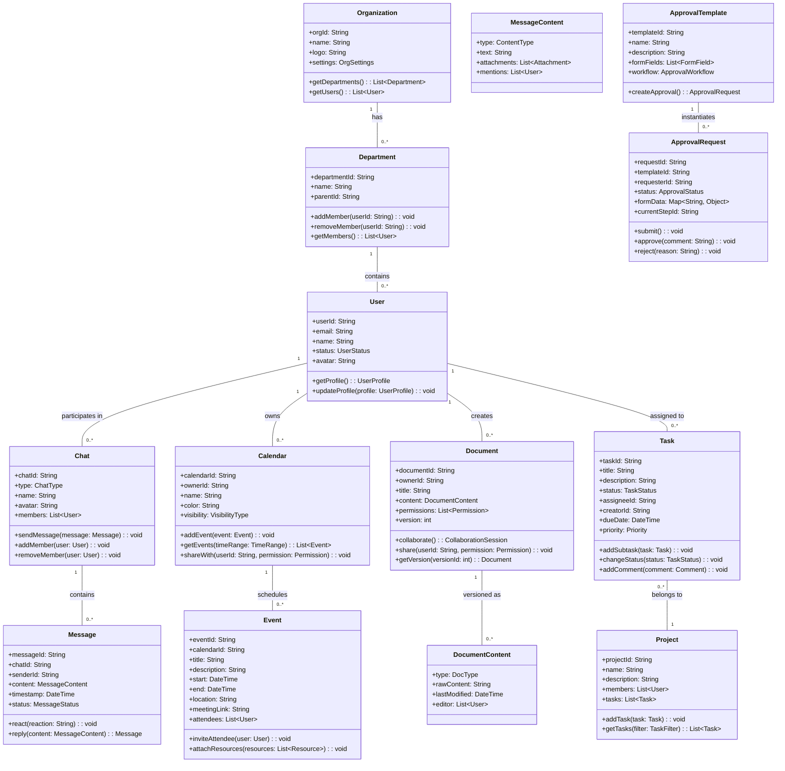
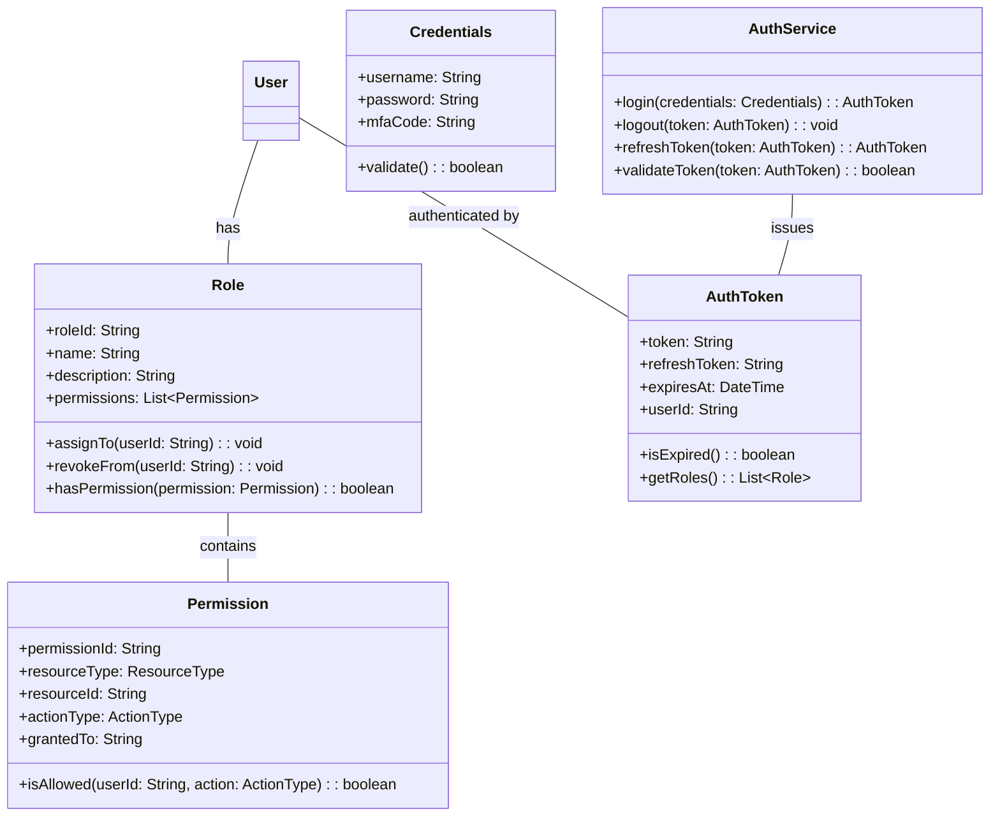
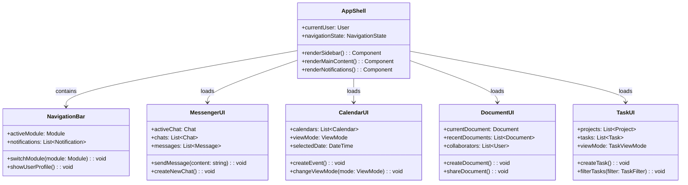

# Class Diagram for CSA Hello System

## Overview
This document provides class diagrams for the key components of CSA Hello, an all-in-one enterprise information and collaboration management system designed with reference to **Lark Suite**. The diagrams illustrate the object-oriented design and relationships between classes across different modules.

## Core Domain Model (Inspired by Lark Suite)

## Authentication and Authorization (Based on Lark Suite's Security Model)

## Microservices Architecture (Inspired by Lark Suite's Backend)

```mermaid
classDiagram
    class APIGateway {
        +routeRequest(request: Request): Response
        +authenticateRequest(request: Request): boolean
        +rateLimit(clientId: String): boolean
    }
    
    class MessengerService {
        +createChat(chatRequest: CreateChatRequest): Chat
        +sendMessage(messageRequest: SendMessageRequest): Message
        +getChats(userId: String): List~Chat~
        +getMessages(chatId: String, pagination: Pagination): List~Message~
    }
    
    class CalendarService {
        +createCalendar(calendarRequest: CreateCalendarRequest): Calendar
        +createEvent(eventRequest: CreateEventRequest): Event
        +getUserCalendars(userId: String): List~Calendar~
        +getEvents(calendarId: String, timeRange: TimeRange): List~Event~
    }
    
    class DocumentService {
        +createDocument(documentRequest: CreateDocumentRequest): Document
        +getDocument(documentId: String): Document
        +updateDocument(documentId: String, content: DocumentContent): Document
        +shareDocument(documentId: String, shareRequest: ShareRequest): void
    }
    
    class TaskService {
        +createTask(taskRequest: CreateTaskRequest): Task
        +updateTaskStatus(taskId: String, status: TaskStatus): Task
        +getUserTasks(userId: String, filter: TaskFilter): List~Task~
        +createProject(projectRequest: CreateProjectRequest): Project
    }
    
    class ApprovalService {
        +createTemplate(templateRequest: TemplateRequest): ApprovalTemplate
        +submitApproval(approvalRequest: SubmitApprovalRequest): ApprovalRequest
        +approveRequest(requestId: String, approval: ApprovalAction): void
        +getRequestsForAction(userId: String): List~ApprovalRequest~
    }
    
    class AdminService {
        +createUser(userRequest: CreateUserRequest): User
        +updateUser(userId: String, userRequest: UpdateUserRequest): User
        +createDepartment(departmentRequest: DepartmentRequest): Department
        +getOrganizationStructure(): Organization
    }
    
    %% Relationships
    APIGateway --> MessengerService: routes to
    APIGateway --> CalendarService: routes to
    APIGateway --> DocumentService: routes to
    APIGateway --> TaskService: routes to
    APIGateway --> ApprovalService: routes to
    APIGateway --> AdminService: routes to
    
    MessengerService --> Message: manages
    MessengerService --> Chat: manages
    CalendarService --> Calendar: manages
    CalendarService --> Event: manages
    DocumentService --> Document: manages
    TaskService --> Task: manages
    TaskService --> Project: manages
    ApprovalService --> ApprovalTemplate: manages
    ApprovalService --> ApprovalRequest: manages
    AdminService --> User: manages
    AdminService --> Department: manages
    AdminService --> Organization: manages
```

## Frontend Component Architecture (Similar to Lark Suite Client)

## Notes on Implementation
- The class diagrams are designed to mirror Lark Suite's architecture while being adapted for CSA Hello's specific requirements.
- Implementation should follow modern object-oriented design patterns with proper separation of concerns.
- The microservices architecture allows for independent scaling and deployment of each module.
- The frontend components should be implemented using a component-based framework like React for the web client and Flutter for mobile applications.
