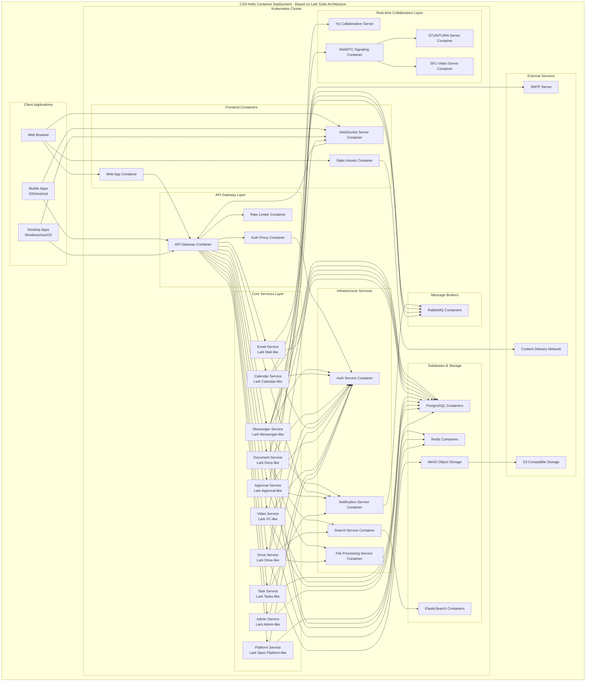

# Container Deployment Architecture for CSA Hello

## Overview
This document outlines the container deployment architecture for CSA Hello, an all-in-one enterprise information and collaboration management system designed with reference to **Lark Suite**. The architecture is built on containerized microservices using Docker and Kubernetes.

## Container Deployment Diagram



## Container Deployment Strategy

### Containers and Images (Based on Lark Suite Architecture)

1. **Frontend Containers:**
   - **Web App Container:** React-based frontend application (similar to Lark Suite's web client)
   - **WebSocket Server:** Handles real-time communication (comparable to Lark's real-time messaging infrastructure)
   - **Static Assets:** Serves optimized static files (images, CSS, JS)

2. **API Gateway Layer:**
   - **API Gateway Container:** Entry point for all API requests (inspired by Lark's API gateway architecture)
   - **Auth Proxy:** Handles authentication verification
   - **Rate Limiter:** Prevents abuse through request limiting

3. **Core Service Containers (Each based on equivalent Lark Suite service):**
   - **Messenger Service:** Handles chat functionality
   - **Calendar Service:** Manages scheduling and events
   - **Document Service:** Provides collaborative document editing
   - **Drive Service:** Manages file storage and sharing
   - **Email Service:** Handles email integration
   - **Task Service:** Manages tasks and projects
   - **Approval Service:** Handles workflow approvals
   - **Video Service:** Manages video conferencing
   - **Admin Service:** Provides admin console functionality
   - **Platform Service:** Offers extensibility through APIs

4. **Infrastructure Services:**
   - **Auth Service:** Centralized authentication and authorization
   - **Notification Service:** Manages push notifications
   - **Search Service:** Provides global search functionality
   - **File Processing Service:** Handles file conversions and previews

5. **Real-time Collaboration Layer:**
   - **Yjs Collaboration Server:** Enables real-time document collaboration
   - **WebRTC Signaling:** Manages WebRTC connections
   - **STUN/TURN Server:** Facilitates peer connections
   - **SFU Video Server:** Scales video conferences for larger groups

6. **Databases & Storage:**
   - **PostgreSQL Containers:** Primary relational database
   - **Redis Containers:** For caching and real-time features
   - **MinIO Object Storage:** S3-compatible storage for files
   - **ElasticSearch:** For search indexing

7. **Message Brokers:**
   - **RabbitMQ Containers:** For asynchronous communication between services

## Container Orchestration with Kubernetes (Similar to Lark Suite's Infrastructure)

### Resource Allocation

```yaml
# Example Kubernetes resource allocation for key containers (similar to Lark Suite's resource patterns)
apiVersion: apps/v1
kind: Deployment
metadata:
  name: messenger-service
spec:
  replicas: 3  # Scale based on demand
  template:
    spec:
      containers:
      - name: messenger
        image: csa-hello/messenger-service:latest
        resources:
          limits:
            cpu: "1"
            memory: "1Gi"
          requests:
            cpu: "500m"
            memory: "512Mi"
        livenessProbe:
          httpGet:
            path: /health
            port: 8080
        readinessProbe:
          httpGet:
            path: /ready
            port: 8080
```

### Horizontal Pod Autoscaling

```yaml
# Example HPA configuration (similar to Lark Suite's autoscaling approach)
apiVersion: autoscaling/v2
kind: HorizontalPodAutoscaler
metadata:
  name: messenger-service-hpa
spec:
  scaleTargetRef:
    apiVersion: apps/v1
    kind: Deployment
    name: messenger-service
  minReplicas: 2
  maxReplicas: 10
  metrics:
  - type: Resource
    resource:
      name: cpu
      target:
        type: Utilization
        averageUtilization: 70
```

## Deployment Workflow (Similar to Lark Suite's CI/CD Pipeline)

1. **Container Building:**
   - Build Docker images for each microservice
   - Tag images with version and commit hash
   - Push images to container registry

2. **Deployment Strategies:**
   - **Blue/Green Deployment:** For frontend and stateless services
   - **Rolling Updates:** For most backend services
   - **Stateful Services:** Special handling for databases using StatefulSets

3. **Configuration Management:**
   - Use Kubernetes ConfigMaps for service configuration
   - Use Kubernetes Secrets for sensitive data
   - Environment-specific configurations

4. **Monitoring and Logging:**
   - Prometheus for metrics collection
   - Grafana for visualization
   - ELK stack for log aggregation

## Network Architecture

### Service Mesh (Optional)

For larger deployments, a service mesh (like Istio or Linkerd) can be implemented to manage service-to-service communication, similar to how Lark Suite manages its internal service communication.

### Ingress Configuration

```yaml
# Example Ingress configuration (similar to Lark Suite's edge routing)
apiVersion: networking.k8s.io/v1
kind: Ingress
metadata:
  name: csa-hello-ingress
  annotations:
    nginx.ingress.kubernetes.io/ssl-redirect: "true"
spec:
  rules:
  - host: app.csa-hello.example
    http:
      paths:
      - path: /api
        pathType: Prefix
        backend:
          service:
            name: api-gateway
            port:
              number: 80
      - path: /ws
        pathType: Prefix
        backend:
          service:
            name: websocket-server
            port:
              number: 80
      - path: /
        pathType: Prefix
        backend:
          service:
            name: web-app
            port:
              number: 80
```

## Container Security Best Practices (Following Lark Suite's Security Standards)

1. **Container Hardening:**
   - Use minimal base images
   - Run containers with non-root users
   - Implement read-only file systems where possible

2. **Image Scanning:**
   - Scan container images for vulnerabilities
   - Enforce security policies

3. **Runtime Security:**
   - Implement pod security policies
   - Use network policies for service isolation
   - Enable audit logging

4. **Secret Management:**
   - Use Kubernetes secrets for sensitive data
   - Consider external secret management solutions for production

## High Availability and Disaster Recovery

1. **Data Backup Strategy:**
   - Regular database backups
   - Object storage replication
   - Multi-region considerations for critical data

2. **Recovery Procedures:**
   - Database restore processes
   - Service recovery prioritization
   - Automated and manual failover procedures
