# FastAPI Backend Architecture for CSA Hello

## Overview
This document outlines the FastAPI-based backend architecture for CSA Hello, an all-in-one enterprise information and collaboration management system designed with reference to **Lark Suite**. The architecture follows modern microservices principles similar to Lark Suite's backend design.

## Backend Architecture Diagram

```mermaid
graph TD
    subgraph "CSA Hello Backend Architecture (Based on Lark Suite Design)"
        subgraph "API Gateway Layer"
            Gateway[API Gateway\nFastAPI Application]
            Auth[Auth Middleware]
            RateLimit[Rate Limiting]
            RequestValidation[Request Validation]
            ResponseFormatting[Response Formatting]
        end
        
        subgraph "Microservices Layer"
            MS_Messenger[Messenger Service\nFastAPI App]
            MS_Calendar[Calendar Service\nFastAPI App]
            MS_Docs[Document Service\nFastAPI App]
            MS_Drive[Drive Service\nFastAPI App]
            MS_Email[Email Service\nFastAPI App]
            MS_Tasks[Task Service\nFastAPI App]
            MS_Approval[Approval Service\nFastAPI App]
            MS_Video[Video Service\nFastAPI App]
            MS_Admin[Admin Service\nFastAPI App]
            MS_Platform[Platform Service\nFastAPI App]
        end
        
        subgraph "Common Libraries Layer"
            BaseModels[Pydantic Base Models]
            AuthLib[Authentication Library]
            CommonUtils[Common Utilities]
            EventBus[Event Bus Client]
            DatabaseUtils[Database Utilities]
            CacheUtils[Cache Utilities]
            StorageUtils[Storage Utilities]
            Logging[Logging Framework]
        end
        
        subgraph "Data Access Layer"
            subgraph "Database Access"
                SQLAlchemy[SQLAlchemy ORM]
                Migrations[Alembic Migrations]
                QueryBuilders[Query Builders]
            end
            
            subgraph "Cache Access"
                RedisClient[Redis Client]
                CachePatterns[Caching Patterns]
            end
            
            subgraph "Object Storage Access"
                S3Client[S3 Client]
                BlobStorage[Blob Storage Handler]
            end
        end
        
        subgraph "External Integrations"
            EmailIntegration[Email Integration]
            WebRTC[WebRTC Integration]
            WebSockets[WebSocket Handler]
            OAuth[OAuth Providers]
        end
        
        subgraph "Background Tasks"
            TaskQueue[Task Queue]
            Workers[Background Workers]
            Scheduler[Scheduled Tasks]
        end
    end
    
    %% Connections between components
    Gateway --> Auth
    Gateway --> RateLimit
    Gateway --> RequestValidation
    Gateway --> ResponseFormatting
    
    Gateway --> MS_Messenger
    Gateway --> MS_Calendar
    Gateway --> MS_Docs
    Gateway --> MS_Drive
    Gateway --> MS_Email
    Gateway --> MS_Tasks
    Gateway --> MS_Approval
    Gateway --> MS_Video
    Gateway --> MS_Admin
    Gateway --> MS_Platform
    
    MS_Messenger --> BaseModels
    MS_Calendar --> BaseModels
    MS_Docs --> BaseModels
    MS_Drive --> BaseModels
    MS_Email --> BaseModels
    MS_Tasks --> BaseModels
    MS_Approval --> BaseModels
    MS_Video --> BaseModels
    MS_Admin --> BaseModels
    MS_Platform --> BaseModels
    
    MS_Messenger --> AuthLib
    MS_Calendar --> AuthLib
    MS_Docs --> AuthLib
    MS_Drive --> AuthLib
    MS_Email --> AuthLib
    MS_Tasks --> AuthLib
    MS_Approval --> AuthLib
    MS_Video --> AuthLib
    MS_Admin --> AuthLib
    MS_Platform --> AuthLib
    
    MS_Messenger --> CommonUtils
    MS_Calendar --> CommonUtils
    MS_Docs --> CommonUtils
    MS_Drive --> CommonUtils
    MS_Email --> CommonUtils
    MS_Tasks --> CommonUtils
    MS_Approval --> CommonUtils
    MS_Video --> CommonUtils
    MS_Admin --> CommonUtils
    MS_Platform --> CommonUtils
    
    MS_Messenger --> EventBus
    MS_Calendar --> EventBus
    MS_Docs --> EventBus
    MS_Drive --> EventBus
    MS_Email --> EventBus
    MS_Tasks --> EventBus
    MS_Approval --> EventBus
    MS_Video --> EventBus
    MS_Admin --> EventBus
    MS_Platform --> EventBus
    
    MS_Messenger --> SQLAlchemy
    MS_Calendar --> SQLAlchemy
    MS_Docs --> SQLAlchemy
    MS_Drive --> SQLAlchemy
    MS_Email --> SQLAlchemy
    MS_Tasks --> SQLAlchemy
    MS_Approval --> SQLAlchemy
    MS_Video --> SQLAlchemy
    MS_Admin --> SQLAlchemy
    MS_Platform --> SQLAlchemy
    
    MS_Messenger --> RedisClient
    MS_Calendar --> RedisClient
    MS_Docs --> RedisClient
    MS_Video --> RedisClient
    
    MS_Drive --> S3Client
    MS_Docs --> S3Client
    
    MS_Email --> EmailIntegration
    MS_Video --> WebRTC
    MS_Messenger --> WebSockets
    MS_Docs --> WebSockets
    
    MS_Messenger --> TaskQueue
    MS_Calendar --> TaskQueue
    MS_Docs --> TaskQueue
    MS_Drive --> TaskQueue
    MS_Email --> TaskQueue
    MS_Tasks --> TaskQueue
    MS_Approval --> TaskQueue
    MS_Video --> TaskQueue
    MS_Admin --> TaskQueue
    MS_Platform --> TaskQueue
```



## FastAPI Backend Implementation (Inspired by Lark Suite Architecture)

### API Gateway Implementation

The API Gateway serves as the single entry point for all client requests, similar to how Lark Suite manages its API interactions:

```python
# Example API Gateway using FastAPI (inspired by Lark Suite's API gateway pattern)
from fastapi import FastAPI, Depends, HTTPException, Request
from fastapi.middleware.cors import CORSMiddleware
from fastapi.responses import JSONResponse
import httpx

app = FastAPI(title="CSA Hello API Gateway", 
             description="API Gateway for CSA Hello, inspired by Lark Suite's architecture")

# Add middleware similar to Lark's approach
app.add_middleware(
    CORSMiddleware,
    allow_origins=["*"],  # Adjust for production
    allow_credentials=True,
    allow_methods=["*"],
    allow_headers=["*"],
)

# Authentication middleware
@app.middleware("http")
async def authenticate_request(request: Request, call_next):
    # Extract and validate token
    token = request.headers.get("Authorization")
    if not token and not request.url.path.startswith("/auth"):
        return JSONResponse(status_code=401, content={"detail": "Authentication required"})
    
    # Validate token with Auth service
    # This is simplified - actual implementation would validate with Auth service
    
    response = await call_next(request)
    return response

# Rate limiting middleware
@app.middleware("http")
async def rate_limit(request: Request, call_next):
    client_ip = request.client.host
    # Implement rate limiting logic here
    # ...
    response = await call_next(request)
    return response

# Route requests to appropriate microservices
@app.api_route("/{service_name}/{path_name:path}", methods=["GET", "POST", "PUT", "DELETE"])
async def api_gateway(service_name: str, path_name: str, request: Request):
    # Map service_name to actual service URL
    service_map = {
        "messenger": "http://messenger-service:8000",
        "calendar": "http://calendar-service:8000",
        "docs": "http://document-service:8000",
        "drive": "http://drive-service:8000",
        "email": "http://email-service:8000",
        "tasks": "http://task-service:8000",
        "approvals": "http://approval-service:8000",
        "video": "http://video-service:8000",
        "admin": "http://admin-service:8000",
        "platform": "http://platform-service:8000",
    }
    
    if service_name not in service_map:
        raise HTTPException(status_code=404, detail=f"Service {service_name} not found")
    
    # Forward the request to the appropriate microservice
    target_url = f"{service_map[service_name]}/{path_name}"
    
    # Get request body if any
    body = None
    if request.method in ["POST", "PUT"]:
        body = await request.body()
    
    # Forward headers, excluding host
    headers = {k: v for k, v in request.headers.items() if k.lower() != "host"}
    
    async with httpx.AsyncClient() as client:
        response = await client.request(
            method=request.method,
            url=target_url,
            headers=headers,
            params=request.query_params,
            content=body,
            timeout=30.0
        )
        
        return JSONResponse(
            status_code=response.status_code,
            content=response.json(),
            headers=dict(response.headers)
        )
```

### Microservice Implementation Template

Each microservice follows a consistent structure while implementing module-specific functionality, similar to Lark Suite's microservices approach:

```python
# Example Microservice Template (similar to Lark Suite's microservice pattern)
from fastapi import FastAPI, Depends, HTTPException
from fastapi.middleware.cors import CORSMiddleware
from sqlalchemy.orm import Session
from typing import List

from .database import get_db
from .models import Base, SomeModel
from .schemas import SomeModelSchema, SomeModelCreate, SomeModelUpdate
from .auth import get_current_user, User
from .events import publish_event

app = FastAPI(title="CSA Hello Service", 
             description="Microservice for CSA Hello, based on Lark Suite design patterns")

# Add CORS middleware
app.add_middleware(
    CORSMiddleware,
    allow_origins=["*"],
    allow_credentials=True,
    allow_methods=["*"],
    allow_headers=["*"],
)

# Health check endpoint
@app.get("/health")
def health_check():
    return {"status": "healthy"}

# CRUD operations
@app.post("/items/", response_model=SomeModelSchema)
def create_item(
    item: SomeModelCreate, 
    db: Session = Depends(get_db),
    current_user: User = Depends(get_current_user)
):
    # Check permissions
    if not current_user.can_create_item:
        raise HTTPException(status_code=403, detail="Not enough permissions")
    
    # Create item in database
    db_item = SomeModel(**item.dict(), owner_id=current_user.id)
    db.add(db_item)
    db.commit()
    db.refresh(db_item)
    
    # Publish event for other services
    publish_event("item_created", db_item.id)
    
    return db_item

@app.get("/items/", response_model=List[SomeModelSchema])
def read_items(
    skip: int = 0, 
    limit: int = 100,
    db: Session = Depends(get_db),
    current_user: User = Depends(get_current_user)
):
    # Apply filters based on user permissions
    items = db.query(SomeModel).filter(
        SomeModel.owner_id == current_user.id
    ).offset(skip).limit(limit).all()
    
    return items

@app.get("/items/{item_id}", response_model=SomeModelSchema)
def read_item(
    item_id: int, 
    db: Session = Depends(get_db),
    current_user: User = Depends(get_current_user)
):
    # Get item from database
    item = db.query(SomeModel).filter(SomeModel.id == item_id).first()
    
    # Check if item exists
    if item is None:
        raise HTTPException(status_code=404, detail="Item not found")
    
    # Check if user has permission to view this item
    if item.owner_id != current_user.id and not current_user.is_admin:
        raise HTTPException(status_code=403, detail="Not enough permissions")
    
    return item

@app.put("/items/{item_id}", response_model=SomeModelSchema)
def update_item(
    item_id: int,
    item: SomeModelUpdate,
    db: Session = Depends(get_db),
    current_user: User = Depends(get_current_user)
):
    # Get existing item
    db_item = db.query(SomeModel).filter(SomeModel.id == item_id).first()
    
    # Check if item exists
    if db_item is None:
        raise HTTPException(status_code=404, detail="Item not found")
    
    # Check if user has permission to update this item
    if db_item.owner_id != current_user.id and not current_user.is_admin:
        raise HTTPException(status_code=403, detail="Not enough permissions")
    
    # Update item fields
    for key, value in item.dict(exclude_unset=True).items():
        setattr(db_item, key, value)
    
    # Save changes
    db.commit()
    db.refresh(db_item)
    
    # Publish event
    publish_event("item_updated", db_item.id)
    
    return db_item

@app.delete("/items/{item_id}")
def delete_item(
    item_id: int,
    db: Session = Depends(get_db),
    current_user: User = Depends(get_current_user)
):
    # Get existing item
    db_item = db.query(SomeModel).filter(SomeModel.id == item_id).first()
    
    # Check if item exists
    if db_item is None:
        raise HTTPException(status_code=404, detail="Item not found")
    
    # Check if user has permission to delete this item
    if db_item.owner_id != current_user.id and not current_user.is_admin:
        raise HTTPException(status_code=403, detail="Not enough permissions")
    
    # Delete item
    db.delete(db_item)
    db.commit()
    
    # Publish event
    publish_event("item_deleted", item_id)
    
    return {"status": "success", "message": f"Item {item_id} deleted"}
```

## FastAPI Service Architecture Details

### 1. Module-Specific Service Implementations (Based on Lark Suite Modules)

#### Messenger Service (Similar to Lark Messenger)
- Real-time messaging API
- Chat room management
- Message history and search
- WebSocket integration for live updates
- Integration with notification service

#### Calendar Service (Similar to Lark Calendar)
- Event creation and management
- Scheduling and availability checking
- Recurring event patterns
- Time zone handling
- Meeting resource booking

#### Document Service (Similar to Lark Docs)
- Document creation and management
- Real-time collaboration via WebSockets
- Version control and history
- Document export/import handlers
- Integration with Yjs for collaborative editing

#### Drive Service (Similar to Lark Drive)
- File upload and download API
- Folder structure management
- File sharing and permissions
- File metadata handling
- Integration with object storage

#### Email Service (Similar to Lark Mail)
- Email sending and receiving
- Email threading and organization
- SMTP/IMAP gateway integration
- Email search functionality
- Attachment handling with Drive integration

#### Task Service (Similar to Lark Tasks)
- Task creation and assignment
- Project management
- Task status tracking
- Deadline notifications
- Integration with Calendar service

#### Approval Service (Similar to Lark Approval)
- Workflow definition and management
- Form creation and validation
- Approval status tracking
- Multi-step approval processes
- Integration with notification service

#### Video Service (Similar to Lark Video Conference)
- WebRTC signaling
- Room creation and management
- Meeting recording and storage
- Screen sharing coordination
- Integration with Calendar service

#### Admin Service (Similar to Lark Admin Console)
- User management
- Organization structure management
- Permission and role management
- System settings configuration
- Usage statistics and reporting

#### Platform Service (Similar to Lark Open Platform)
- API token management
- Webhook registration and delivery
- App integration management
- Developer tools and documentation
- OAuth authorization server

### 2. Common Features Across Services

- **Authentication & Authorization:** Token validation, role-based access control
- **Request Validation:** Using Pydantic models for type validation
- **Response Formatting:** Consistent API response structure
- **Error Handling:** Standardized error responses
- **Logging & Monitoring:** Structured logging for observability
- **Rate Limiting:** Protection against abuse
- **Database Operations:** With SQLAlchemy and transaction management
- **Caching:** Redis-based caching for performance
- **Event Publishing:** Service-to-service communication via message broker

### 3. Database Models and Schema Design

Each service has its own database models and schemas, designed to avoid tight coupling while allowing necessary integrations:

```python
# Example of Pydantic models for schema definition (similar to Lark Suite's approach)
from pydantic import BaseModel, Field, EmailStr
from typing import List, Optional
from datetime import datetime
from uuid import UUID

# Base user model shared across services
class UserBase(BaseModel):
    id: UUID
    display_name: str
    email: EmailStr
    avatar_url: Optional[str] = None

# Message schema for Messenger service
class MessageSchema(BaseModel):
    id: UUID
    chat_id: UUID
    sender: UserBase
    content: str
    timestamp: datetime
    attachments: Optional[List[dict]] = []
    reactions: Optional[List[dict]] = []
    is_pinned: bool = False
    
    class Config:
        orm_mode = True

# Event schema for Calendar service
class EventSchema(BaseModel):
    id: UUID
    title: str
    description: Optional[str] = None
    start_time: datetime
    end_time: datetime
    location: Optional[str] = None
    organizer: UserBase
    attendees: List[UserBase]
    is_all_day: bool = False
    recurrence_rule: Optional[str] = None
    
    class Config:
        orm_mode = True
```

## API Documentation and OpenAPI Integration

CSA Hello leverages FastAPI's automatic OpenAPI documentation generation, providing interactive API documentation for all services, similar to how Lark Suite documents its APIs:

```python
# API documentation configuration
app = FastAPI(
    title="CSA Hello API",
    description="API documentation for CSA Hello - All-in-one collaboration system inspired by Lark Suite",
    version="1.0.0",
    openapi_tags=[
        {"name": "messenger", "description": "Messaging operations"},
        {"name": "calendar", "description": "Calendar and scheduling operations"},
        {"name": "documents", "description": "Document management operations"},
        {"name": "drive", "description": "File storage operations"},
        # Other module tags...
    ],
    docs_url="/api/docs",
    redoc_url="/api/redoc",
)
```

## Testing Strategy

Following Lark Suite's quality standards, CSA Hello implements a comprehensive testing approach:

- **Unit Tests:** For individual components and functions
- **Integration Tests:** For service interactions
- **API Tests:** For endpoint validation
- **Performance Tests:** For response time and throughput benchmarking
- **Load Tests:** For scalability validation

```python
# Example test using pytest (similar to testing approaches in enterprise systems like Lark Suite)
from fastapi.testclient import TestClient
import pytest
from unittest.mock import patch

from .main import app
from .database import get_db

client = TestClient(app)

def test_create_item(mock_db_session, mock_current_user):
    # Setup test data
    test_item = {"name": "Test Item", "description": "This is a test"}
    
    # Mock database and authentication dependencies
    with patch("app.dependencies.get_db", return_value=mock_db_session):
        with patch("app.dependencies.get_current_user", return_value=mock_current_user):
            # Make request
            response = client.post("/items/", json=test_item)
            
            # Verify response
            assert response.status_code == 200
            data = response.json()
            assert data["name"] == test_item["name"]
            assert data["description"] == test_item["description"]
            assert data["owner_id"] == mock_current_user.id
            
            # Verify database interaction
            mock_db_session.add.assert_called_once()
            mock_db_session.commit.assert_called_once()
```

## Deployment Configuration

Each FastAPI service is packaged as a Docker container with its own Dockerfile:

```dockerfile
# Example Dockerfile for a FastAPI microservice (following container best practices)
FROM python:3.9-slim

WORKDIR /app

# Install dependencies
COPY requirements.txt .
RUN pip install --no-cache-dir -r requirements.txt

# Copy application code
COPY ./app ./app

# Set environment variables
ENV MODULE_NAME="app.main"
ENV VARIABLE_NAME="app"
ENV PORT=8000

# Expose port
EXPOSE 8000

# Run with Uvicorn server
CMD ["uvicorn", "app.main:app", "--host", "0.0.0.0", "--port", "8000"]
```

## Conclusion

The FastAPI backend architecture for CSA Hello follows modern microservices principles with clear inspiration from Lark Suite's architectural design. Each service is independently deployable, scalable, and maintainable while working together to provide a cohesive platform experience. The use of FastAPI enables rapid development, built-in validation, and automatic API documentation, making it an ideal choice for implementing a comprehensive collaboration system.
