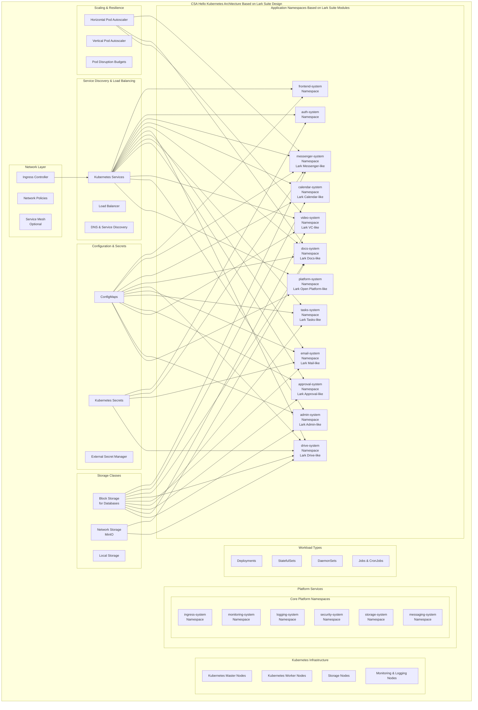

# Kubernetes Architecture for CSA Hello

## Overview
This document outlines the Kubernetes architecture for CSA Hello, an enterprise information and collaboration management system designed with reference to **Lark Suite**. The architecture leverages Kubernetes to provide scalability, resilience, and maintainability.

## Kubernetes Cluster Architecture Diagram



## Namespace Structure (Based on Lark Suite's Modular Design)

CSA Hello uses Kubernetes namespaces to isolate and organize workloads, similar to Lark Suite's modular design:

### Platform Service Namespaces

- **ingress-system**: Houses the ingress controller and related configurations
- **monitoring-system**: Contains Prometheus, Grafana, and alerting components
- **logging-system**: ELK stack (Elasticsearch, Logstash, Kibana) or similar
- **security-system**: Security scanning, policy enforcement
- **storage-system**: Storage operators and controllers
- **messaging-system**: Message brokers and event buses

### Application Namespaces

Each core module of CSA Hello (designed with reference to Lark Suite's modules) has its own namespace:

- **frontend-system**: Web and mobile frontend services
- **auth-system**: Authentication and authorization services
- **messenger-system**: Real-time messaging services (like Lark Messenger)
- **calendar-system**: Calendar and scheduling services (like Lark Calendar)
- **docs-system**: Document collaboration services (like Lark Docs)
- **drive-system**: File storage services (like Lark Drive)
- **email-system**: Email processing services (like Lark Mail)
- **tasks-system**: Task management services (like Lark Tasks)
- **approval-system**: Workflow approval services (like Lark Approval)
- **video-system**: Video conferencing services (like Lark VC)
- **admin-system**: Admin and management services (like Lark Admin Console)
- **platform-system**: API and integration services (like Lark Open Platform)

## Resource Allocation and Limits

Following enterprise-grade practices similar to Lark Suite's infrastructure management:

```yaml
# Example resource allocation for critical services
apiVersion: v1
kind: ResourceQuota
metadata:
  name: messenger-quota
  namespace: messenger-system
spec:
  hard:
    requests.cpu: "8"
    requests.memory: 16Gi
    limits.cpu: "16"
    limits.memory: 32Gi
    pods: "30"
```

```yaml
# Example limits for a deployment
apiVersion: apps/v1
kind: Deployment
metadata:
  name: messenger-service
  namespace: messenger-system
spec:
  replicas: 5
  template:
    spec:
      containers:
      - name: messenger
        resources:
          requests:
            memory: "512Mi"
            cpu: "250m"
          limits:
            memory: "1Gi"
            cpu: "500m"
```

## Horizontal Pod Autoscaling

```yaml
# Horizontal Pod Autoscaler configuration for elastic scaling
apiVersion: autoscaling/v2
kind: HorizontalPodAutoscaler
metadata:
  name: messenger-hpa
  namespace: messenger-system
spec:
  scaleTargetRef:
    apiVersion: apps/v1
    kind: Deployment
    name: messenger-service
  minReplicas: 3
  maxReplicas: 20
  metrics:
  - type: Resource
    resource:
      name: cpu
      target:
        type: Utilization
        averageUtilization: 75
  - type: Resource
    resource:
      name: memory
      target:
        type: Utilization
        averageUtilization: 80
```

## Network Policies (Following Lark Suite's Security Model)

```yaml
# Example network policy protecting the authentication service
apiVersion: networking.k8s.io/v1
kind: NetworkPolicy
metadata:
  name: auth-network-policy
  namespace: auth-system
spec:
  podSelector:
    matchLabels:
      app: auth-service
  policyTypes:
  - Ingress
  - Egress
  ingress:
  - from:
    - namespaceSelector:
        matchLabels:
          kubernetes.io/metadata.name: ingress-system
    - namespaceSelector:
        matchLabels:
          kubernetes.io/metadata.name: frontend-system
    ports:
    - protocol: TCP
      port: 8080
  egress:
  - to:
    - namespaceSelector:
        matchLabels:
          kubernetes.io/metadata.name: storage-system
    - namespaceSelector:
        matchLabels:
          kubernetes.io/metadata.name: messaging-system
```

## Persistent Volume Configuration (For Storage-Intensive Services)

```yaml
# Persistent Volume Claim for document service storage
apiVersion: v1
kind: PersistentVolumeClaim
metadata:
  name: docs-storage
  namespace: docs-system
spec:
  accessModes:
    - ReadWriteMany
  storageClassName: managed-nfs
  resources:
    requests:
      storage: 100Gi
```

## High Availability Configuration (Following Lark Suite's Resilience Patterns)

```yaml
# Pod Disruption Budget to ensure service availability during updates
apiVersion: policy/v1
kind: PodDisruptionBudget
metadata:
  name: messenger-pdb
  namespace: messenger-system
spec:
  minAvailable: 2  # Always keep at least 2 pods running
  selector:
    matchLabels:
      app: messenger-service
```

## Ingress Configuration (For External Access)

```yaml
# Ingress configuration for web access
apiVersion: networking.k8s.io/v1
kind: Ingress
metadata:
  name: csa-hello-ingress
  namespace: ingress-system
  annotations:
    kubernetes.io/ingress.class: "nginx"
    nginx.ingress.kubernetes.io/ssl-redirect: "true"
    nginx.ingress.kubernetes.io/proxy-body-size: "50m"
    cert-manager.io/cluster-issuer: "letsencrypt-prod"
spec:
  tls:
  - hosts:
    - app.csa-hello.example
    secretName: csa-hello-tls
  rules:
  - host: app.csa-hello.example
    http:
      paths:
      - path: /api
        pathType: Prefix
        backend:
          service:
            name: api-gateway
            port:
              number: 80
      - path: /
        pathType: Prefix
        backend:
          service:
            name: frontend
            port:
              number: 80
```

## Stateful Set Example (For Databases)

```yaml
# StatefulSet for PostgreSQL database (used by multiple modules)
apiVersion: apps/v1
kind: StatefulSet
metadata:
  name: postgres
  namespace: storage-system
spec:
  serviceName: postgres
  replicas: 3
  selector:
    matchLabels:
      app: postgres
  template:
    metadata:
      labels:
        app: postgres
    spec:
      containers:
      - name: postgres
        image: postgres:14
        env:
        - name: POSTGRES_PASSWORD
          valueFrom:
            secretKeyRef:
              name: postgres-secrets
              key: password
        ports:
        - containerPort: 5432
          name: postgres
        volumeMounts:
        - name: postgres-data
          mountPath: /var/lib/postgresql/data
        resources:
          requests:
            memory: 2Gi
            cpu: 1
          limits:
            memory: 4Gi
            cpu: 2
  volumeClaimTemplates:
  - metadata:
      name: postgres-data
    spec:
      accessModes: [ "ReadWriteOnce" ]
      storageClassName: fast-storage
      resources:
        requests:
          storage: 100Gi
```

## Service Mesh Integration (Optional, for Complex Deployments)

For larger deployments, CSA Hello can utilize a service mesh like Istio for advanced traffic management, similar to how Lark Suite manages its service-to-service communication:

```yaml
# Example Istio VirtualService for routing
apiVersion: networking.istio.io/v1alpha3
kind: VirtualService
metadata:
  name: messenger-routes
  namespace: messenger-system
spec:
  hosts:
  - messenger-service
  http:
  - match:
    - uri:
        prefix: /api/v1
    route:
    - destination:
        host: messenger-service-v1
        port:
          number: 8080
  - match:
    - uri:
        prefix: /api/v2
    route:
    - destination:
        host: messenger-service-v2
        port:
          number: 8080
```

## ConfigMap Example (For Service Configuration)

```yaml
# ConfigMap for messenger service configuration
apiVersion: v1
kind: ConfigMap
metadata:
  name: messenger-config
  namespace: messenger-system
data:
  WEBSOCKET_HEARTBEAT_INTERVAL: "30"
  MAX_MESSAGE_SIZE: "10485760"  # 10MB
  MESSAGE_RETENTION_DAYS: "90"
  ENABLE_READ_RECEIPTS: "true"
  DEFAULT_CHAT_HISTORY_LIMIT: "100"
```

## Monitoring and Logging Setup (Using Prometheus and ELK Stack)

```yaml
# ServiceMonitor for Prometheus to scrape metrics
apiVersion: monitoring.coreos.com/v1
kind: ServiceMonitor
metadata:
  name: messenger-monitor
  namespace: monitoring-system
spec:
  selector:
    matchLabels:
      app: messenger-service
  namespaceSelector:
    matchNames:
    - messenger-system
  endpoints:
  - port: metrics
    interval: 15s
    path: /metrics
```

## Deployment Strategies

CSA Hello employs multiple deployment strategies for different components:

### Blue-Green Deployment (For Frontend Services)
- Deploy new version alongside old version
- Switch traffic when new version is validated
- Ability to quickly rollback if issues are detected

### Rolling Updates (For Most Backend Services)
- Gradually replace pods with new versions
- Control surge and unavailability parameters
- Automatic health checking before proceeding

### Canary Deployments (For Critical Services)
- Release to a small subset of users
- Monitor for issues before full rollout
- Controlled by service mesh or custom logic

## Security Considerations

Taking inspiration from Lark Suite's enterprise-grade security:

- **Pod Security Policies:** Enforce security contexts and restrict capabilities
- **Secret Management:** Use Kubernetes secrets or external vault solutions
- **Network Security:** Implement network policies for micro-segmentation
- **Image Security:** Scan container images for vulnerabilities
- **RBAC:** Fine-grained access control for Kubernetes resources
- **Audit Logging:** Enable audit logging for cluster activities

## Disaster Recovery Plan

Following industry best practices similar to Lark Suite's resilience planning:

1. **Regular Backups:** Automated backup of all persistent data
2. **Multi-zone Deployments:** Spread workloads across availability zones
3. **Stateful Service Protection:** Special handling for databases and stateful services
4. **Recovery Testing:** Regular drills to validate recovery procedures
5. **Cross-Region Replication:** For critical data (optional)
