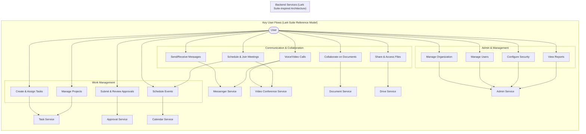
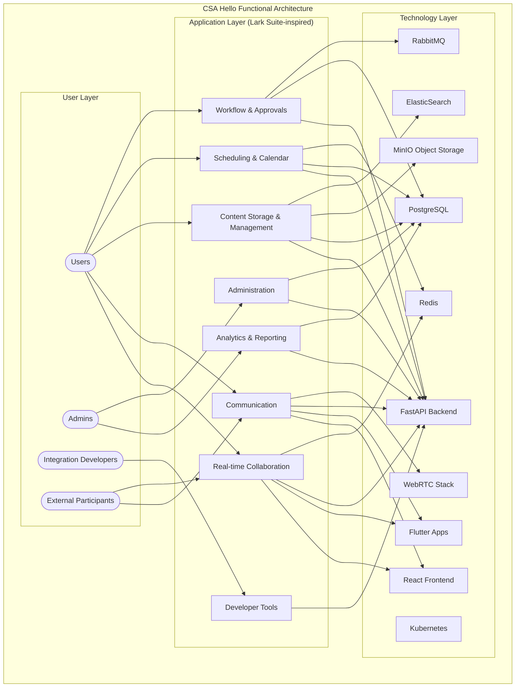
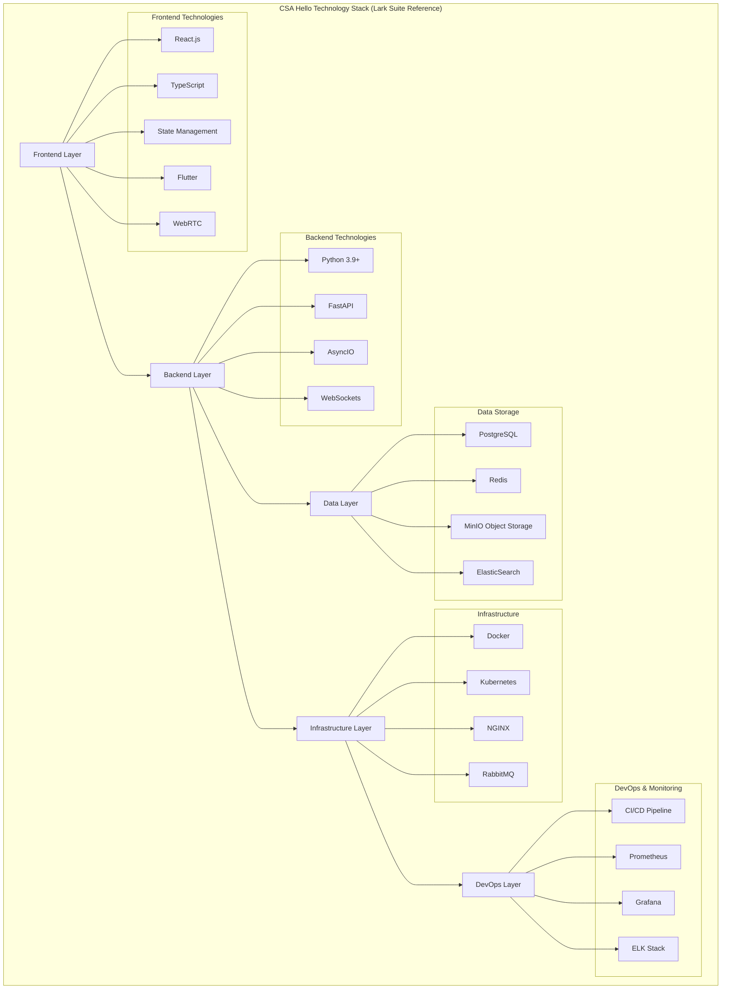
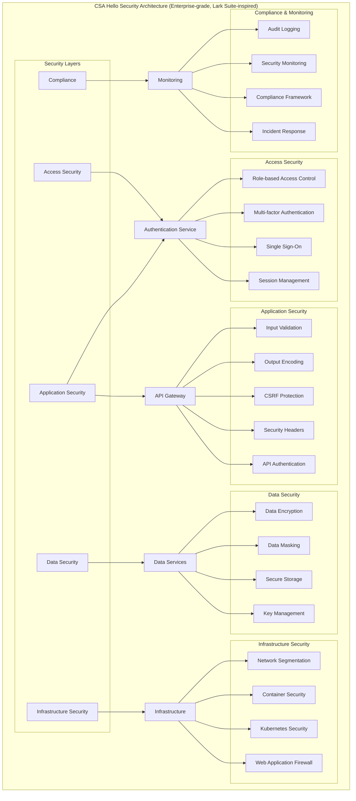
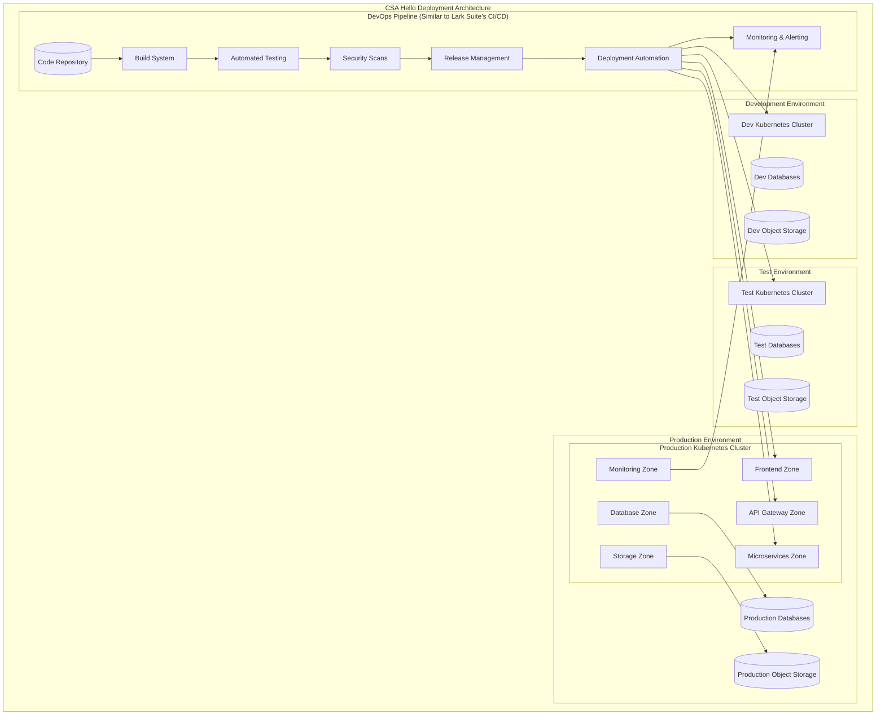
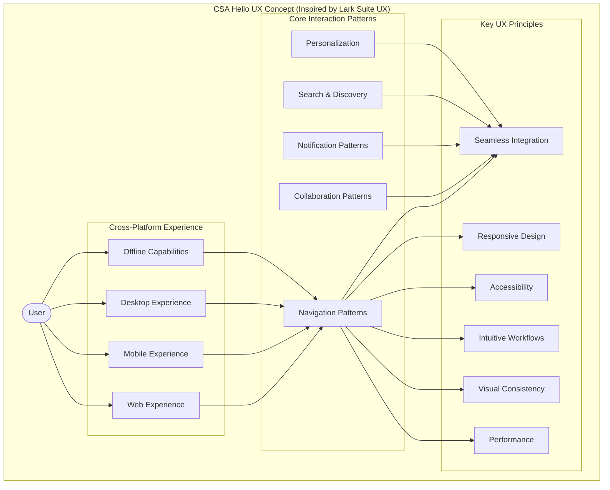
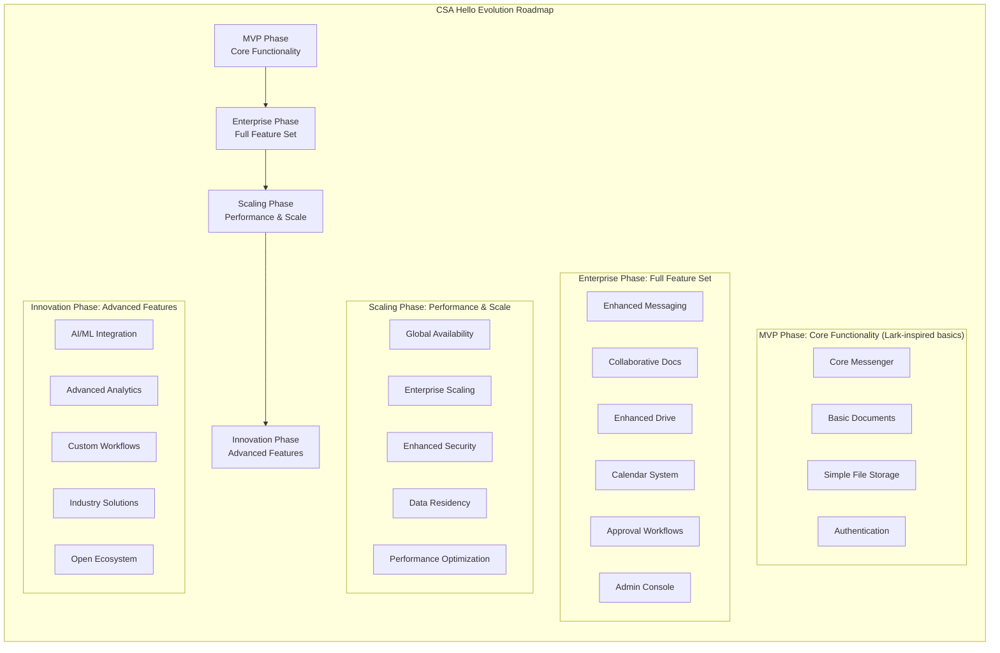

# Summary Diagram (Conceptual) for CSA Hello

## Overview
This document provides a high-level conceptual view of the CSA Hello system, an all-in-one enterprise information and collaboration management platform designed with reference to **Lark Suite**. The diagrams illustrate the overall architecture, key components, and user interactions.

## System Conceptual Overview

```mermaid
graph TD
    subgraph "CSA Hello System (Inspired by Lark Suite)"
        User([User]) --> ClientApps
        
        subgraph "Client Applications"
            ClientApps[Client Applications Layer]
            WebApp[Web App]
            MobileApp[Mobile Apps\niOS/Android]
            DesktopApp[Desktop Apps\nWindows/macOS]
            
            ClientApps --> WebApp
            ClientApps --> MobileApp
            ClientApps --> DesktopApp
        end
        
        WebApp --> Backend
        MobileApp --> Backend
        DesktopApp --> Backend
        
        subgraph "Backend Platform"
            Backend[Backend Services Layer]
            
            APIGateway[API Gateway]
            Backend --> APIGateway
            
            CoreModules[Core Modules\n(Lark Suite-inspired)]
            Backend --> CoreModules
            
            InfraServices[Infrastructure Services]
            Backend --> InfraServices
            
            Databases[(Databases)]
            Backend --> Databases
            
            Storage[(Object Storage)]
            Backend --> Storage
        end
        
        subgraph "Core Modules (Based on Lark Suite)"
            CoreModules --> Messenger[Messenger\n(Chat & Calls)]
            CoreModules --> Calendar[Calendar\n(Scheduling)]
            CoreModules --> Docs[Documents\n(Collaboration)]
            CoreModules --> Drive[Cloud Drive\n(File Storage)]
            CoreModules --> Email[Email Integration]
            CoreModules --> Tasks[Tasks & Projects]
            CoreModules --> Approval[Approvals\n(Workflows)]
            CoreModules --> Video[Video Conferencing]
            CoreModules --> Admin[Admin Console]
            CoreModules --> Platform[Open Platform\n(APIs & Integration)]
        end
        
        subgraph "Infrastructure Services"
            InfraServices --> Auth[Authentication & Authorization]
            InfraServices --> Search[Search]
            InfraServices --> Notification[Notification]
            InfraServices --> RealTime[Real-time Communication]
            InfraServices --> FileProcessing[File Processing]
            InfraServices --> Analytics[Analytics & Reporting]
            InfraServices --> BackgroundJobs[Background Jobs]
        end
        
        subgraph "Deployment Infrastructure"
            Docker[Docker Containers]
            K8s[Kubernetes Orchestration]
            CI[CI/CD Pipeline]
            
            Backend --> Docker
            Docker --> K8s
            K8s --> CI
        end
    end
```

## User Interaction Flows



## Data Flow Overview

```mermaid
graph TD
    subgraph "CSA Hello Data Flow (Based on Lark Suite Model)"
        User([User])
        
        subgraph "Client Layer"
            UI[User Interface\nWeb/Mobile/Desktop]
        end
        
        subgraph "API Layer"
            API[API Gateway]
            Auth[Authentication]
            RateLimit[Rate Limiting]
            Cache[API Cache]
        end
        
        subgraph "Service Layer"
            Services[Core Services\n(Lark Suite-inspired)]
        end
        
        subgraph "Data Layer"
            SQL[(SQL Databases)]
            NoSQL[(NoSQL Databases)]
            ObjectStorage[(Object Storage)]
            SearchIndex[(Search Index)]
            Queue[(Message Queue)]
        end
        
        User --> UI
        UI --> API
        
        API --> Auth
        API --> RateLimit
        API --> Cache
        API --> Services
        
        Services --> SQL
        Services --> NoSQL
        Services --> ObjectStorage
        Services --> SearchIndex
        Services --> Queue
        
        Queue --> Services
    end
```

## Functional Architecture



## System Module Relationships (Based on Lark Suite Integration Model)

```mermaid
graph TD
    subgraph "CSA Hello Module Integrations (Lark Suite-inspired)"
        %% Core Modules
        Messenger[Messenger Service\n(Lark Messenger-like)]
        Calendar[Calendar Service\n(Lark Calendar-like)]
        Docs[Document Service\n(Lark Docs-like)]
        Drive[Drive Service\n(Lark Drive-like)]
        Email[Email Service\n(Lark Mail-like)]
        Tasks[Task Service\n(Lark Tasks-like)]
        Approval[Approval Service\n(Lark Approval-like)]
        Video[Video Service\n(Lark VC-like)]
        Admin[Admin Service\n(Lark Admin-like)]
        Platform[Platform Service\n(Lark Open Platform-like)]
        
        %% Core module integrations
        Messenger <--> Calendar
        Messenger <--> Docs
        Messenger <--> Drive
        Messenger <--> Tasks
        Messenger <--> Video
        
        Calendar <--> Video
        Calendar <--> Tasks
        
        Docs <--> Drive
        
        Email <--> Calendar
        Email <--> Drive
        
        Tasks <--> Calendar
        Tasks <--> Docs
        Tasks <--> Drive
        
        Approval <--> Tasks
        Approval <--> Messenger
        Approval <--> Email
        
        %% Admin connections
        Admin --> Messenger
        Admin --> Calendar
        Admin --> Docs
        Admin --> Drive
        Admin --> Email
        Admin --> Tasks
        Admin --> Approval
        Admin --> Video
        Admin --> Platform
        
        %% Platform connections
        Platform --> Messenger
        Platform --> Calendar
        Platform --> Docs
        Platform --> Drive
        Platform --> Email
        Platform --> Tasks
        Platform --> Approval
        Platform --> Video
    end
```

## Technology Stack Overview



## Security Architecture



## Deployment Model



## User Experience Model



## Evolution Roadmap


