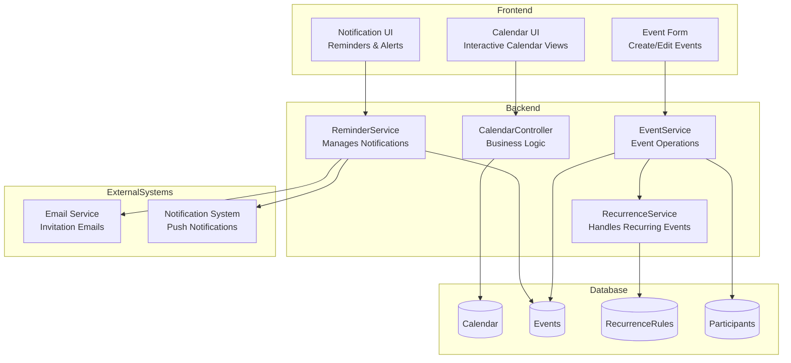
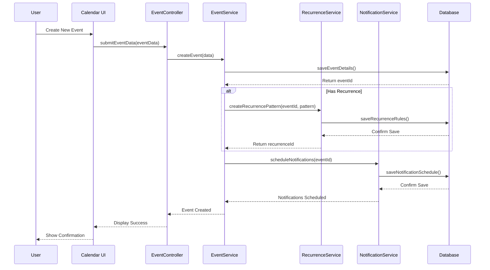
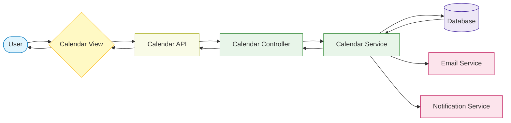
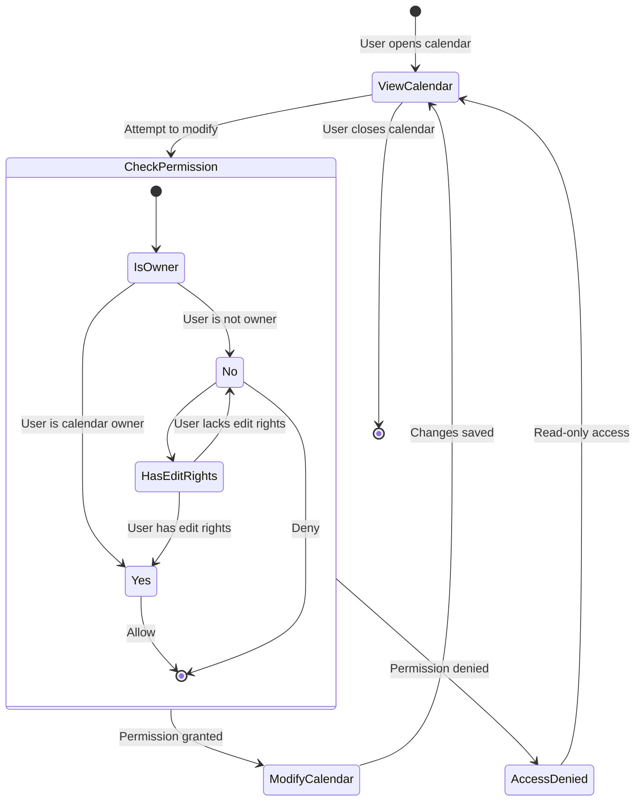

<!-- filepath: d:\projects\CSA\csa-hello\.docs\modules\calendar\module_diagram.md -->
# Calendar Module Diagrams

## Component Architecture

## Event Creation Sequence

## Calendar Data Flow

## User Authorization Flow

