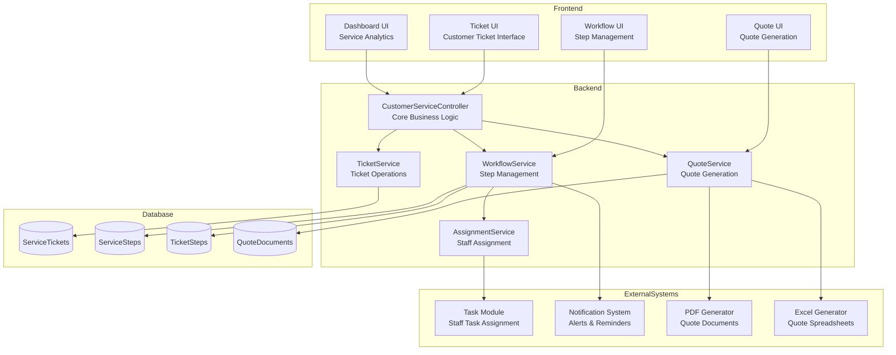
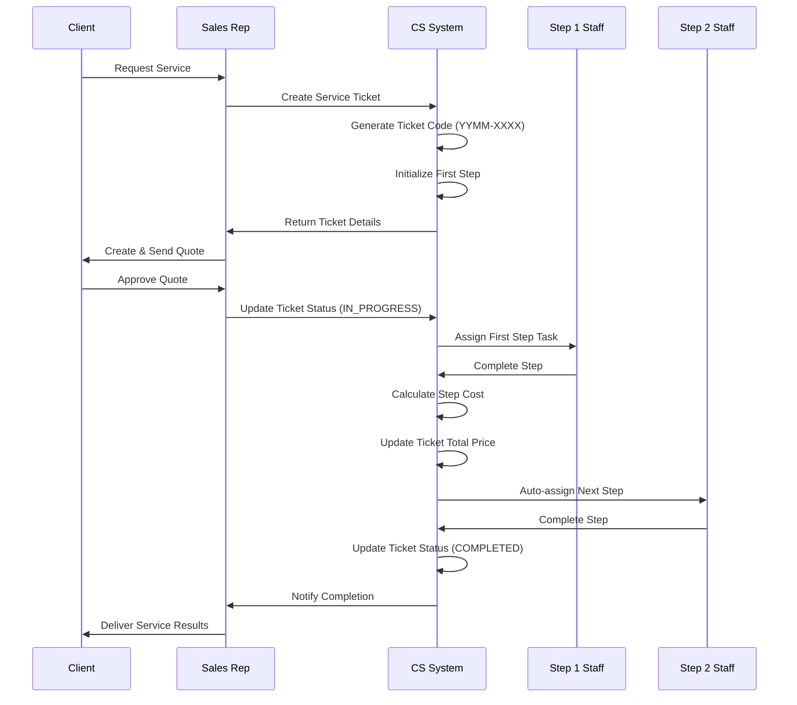
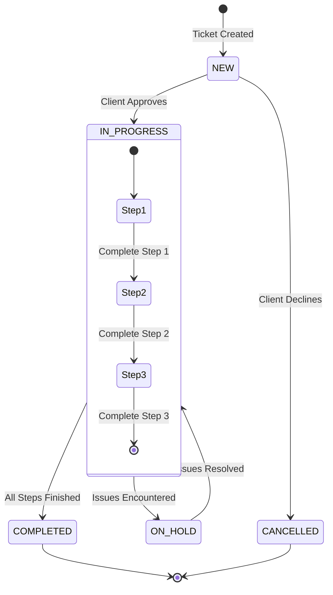

<!-- filepath: d:\projects\CSA\csa-hello\.docs\modules\customer_service\module_diagram.md -->
# Customer Service Module Diagrams

## Component Architecture



## Ticket Workflow Sequence



## Multi-Step Service Flow

```mermaid
flowchart LR
    Init([Ticket Creation])
    Quote[Quote Generation]
    Approval{Client Approval}
    Step1(Step 1: Initial Service)
    Step2(Step 2: Main Delivery)
    Step3(Step 3: Quality Check)
    Step4(Step 4: Final Delivery)
    Complete([Service Complete])
    
    Init --> Quote
    Quote --> Approval
    Approval -->|Yes| Step1
    Approval -->|No| Revised[Revised Quote]
    Revised --> Approval
    
    Step1 --> Step1Status{Completed?}
    Step1Status -->|Yes| Step2
    Step1Status -->|No| Step1
    
    Step2 --> Step2Status{Completed?}
    Step2Status -->|Yes| Step3
    Step2Status -->|No| Step2
    
    Step3 --> QualityCheck{Passes Check?}
    QualityCheck -->|Yes| Step4
    QualityCheck -->|No| RevisionNeeded[Revision Required]
    RevisionNeeded --> Step2
    
    Step4 --> Complete
    
    classDef start fill:#d4f1f9,stroke:#05a4d2
    classDef process fill:#c9e7dd,stroke:#0ca789
    classDef decision fill:#ffe6cc,stroke:#ff9933
    classDef end fill:#f9d1d1,stroke:#e06666
    
    class Init,Quote start
    class Step1,Step2,Step3,Step4,Revised process
    class Approval,Step1Status,Step2Status,QualityCheck decision
    class Complete end
```

## Ticket Status State Diagram


