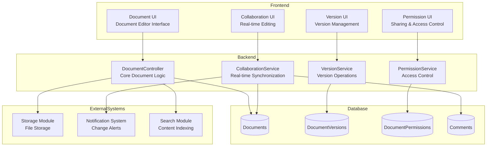
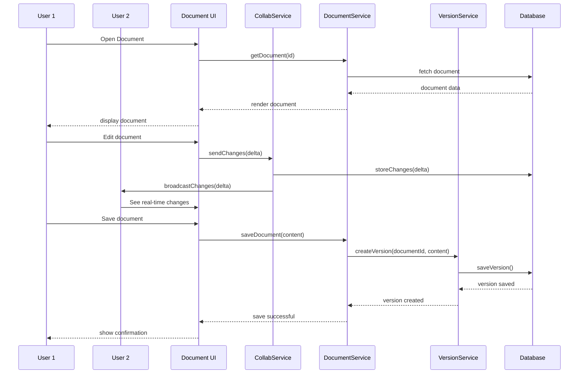
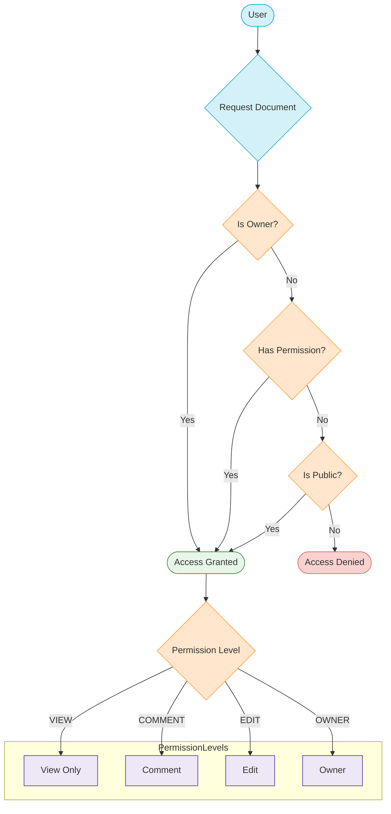
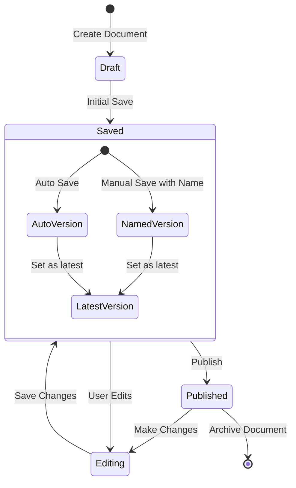

<!-- filepath: d:\projects\CSA\csa-hello\.docs\modules\document\module_diagram.md -->
# Document Module Diagrams

## Component Architecture

## Document Collaboration Sequence

## Document Access Control Flow

## Document Version Control State Diagram

