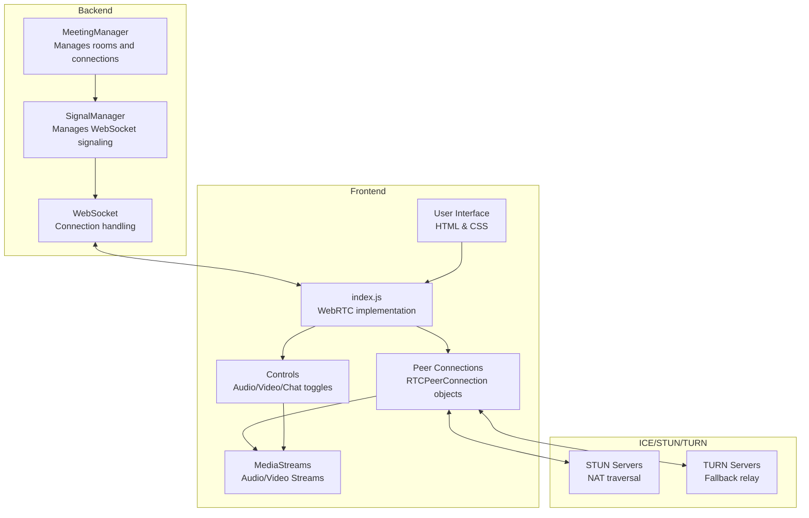

# Meeting Module Component Diagram

This diagram illustrates the architecture of the meeting module which handles WebRTC video conferencing.

## Module Components Description

### Backend Components

- **MeetingManager**: Central manager that handles room creation and client management. It maintains a dictionary of rooms and delegates client handling to the SignalManager.

- **SignalManager**: Handles WebSocket connections for a specific room, manages the state of connected clients, and handles message broadcasting.

- **WebSocket**: FastAPI WebSocket implementation for real-time bidirectional communication.

### Frontend Components

- **User Interface**: HTML/CSS implementation of the video conferencing interface.

- **index.js**: Main JavaScript file that handles WebRTC implementation, including:
  - Media stream acquisition
  - Peer connection establishment
  - Signaling
  - Audio/video controls
  - Chat functionality

- **Peer Connections**: RTCPeerConnection objects that handle the WebRTC connections between clients.

- **MediaStreams**: Local and remote audio/video streams.

- **Controls**: UI components for controlling audio, video, and chat functionality.

### External Services

- **STUN Servers**: Used for NAT traversal to help peers discover their public IP addresses.

- **TURN Servers**: Used as a fallback when direct peer-to-peer communication is not possible (e.g., due to firewalls or NATs).
