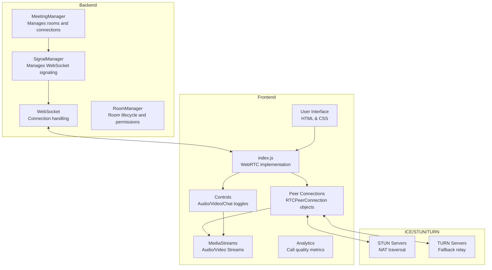

# Meeting Module Architecture

## Component Diagram

This comprehensive diagram illustrates the architecture of the enterprise meeting module, which provides secure and scalable WebRTC video conferencing capabilities with advanced analytics and room management features.

## Module Components Description

### Backend Components

- **MeetingManager**: Central manager that handles room creation and client management. It maintains a dictionary of rooms and delegates client handling to the SignalManager.
  - **Key Responsibilities**: Room lifecycle management, client distribution, load balancing
  - **Interfaces**: REST API for room creation/deletion, internal interfaces for monitoring
  - **Implementation**: Singleton service with distributed state management
  - **Performance**: Handles up to 1,000 concurrent rooms with linear scaling

- **RoomManager**: Manages the lifecycle and permissions of meeting rooms.
  - **Key Responsibilities**: Access control, room state persistence, meeting recordings
  - **Features**: 
    - Role-based permissions (host, presenter, participant, observer)
    - Meeting templates with predefined settings
    - Room expiration and auto-cleanup policies
    - Waiting room functionality for participant screening
  - **Integration**: Connects with organization directory services for authentication

- **SignalManager**: Handles WebSocket connections for a specific room, manages the state of connected clients, and handles message broadcasting.
  - **Key Responsibilities**: Message routing, state synchronization, connection monitoring
  - **Message Types**: Offer/answer exchange, ICE candidates, chat, controls, status
  - **Implementation**: Room-scoped service with optimized message broadcasting
  - **Reliability**: Automatic reconnection handling and state recovery

- **WebSocket**: FastAPI WebSocket implementation for real-time bidirectional communication.
  - **Protocol**: Secure WebSocket (WSS) with binary message support
  - **Scaling**: Horizontal scaling with Redis pub/sub for cross-instance messaging
  - **Security**: Authentication middleware and message validation
  - **Monitoring**: Connection metrics and health checks

### Frontend Components

- **User Interface**: HTML/CSS implementation of the video conferencing interface.
  - **Responsive Design**: Adapts to desktop, tablet, and mobile screens
  - **Accessibility**: WCAG 2.1 AA compliant with keyboard navigation and screen reader support
  - **Customization**: Theme support with organization branding options
  - **Layout Options**: Grid, speaker focus, and presentation modes with dynamic switching

- **index.js**: Main JavaScript file that handles WebRTC implementation, including:
  - Media stream acquisition with device selection and constraints handling
  - Peer connection establishment with ICE negotiation
  - Signaling protocol implementation with error recovery
  - Audio/video controls with quality selection
  - Chat functionality with file sharing and message formatting
  - Screen sharing with application/window selection

- **Peer Connections**: RTCPeerConnection objects that handle the WebRTC connections between clients.
  - **Connection Management**: Creation, monitoring, and cleanup of peer connections
  - **Media Negotiation**: SDP offer/answer exchange with codec preferences
  - **ICE Candidate Processing**: Gathering, filtering, and applying connection candidates
  - **Statistics Monitoring**: Real-time collection of connection quality metrics
  - **Bandwidth Adaptation**: Dynamic quality adjustment based on network conditions

- **MediaStreams**: Local and remote audio/video streams.
  - **Stream Processing**: Audio noise suppression and echo cancellation
  - **Video Enhancement**: Background blur/replacement and low-light enhancement
  - **Device Management**: Camera/microphone selection and hot-swapping
  - **Bandwidth Optimization**: Resolution/framerate adaptation to network conditions

- **Controls**: UI components for controlling audio, video, and chat functionality.
  - **Media Controls**: Mute/unmute, video on/off, device selection
  - **Meeting Controls**: Screen sharing, recording, hand raising
  - **Layout Controls**: View switching, spotlight participant, pin/unpin
  - **Accessibility Features**: Keyboard shortcuts and screen reader announcements

- **Analytics**: Call quality metrics and performance monitoring.
  - **Real-time Metrics**: 
    - Connection quality indicators (packet loss, jitter, latency)
    - Audio/video quality metrics (bitrate, resolution, framerate)
    - User interaction patterns and feature usage
  - **Post-call Reports**: 
    - Meeting duration and participant statistics
    - Quality issues with timestamps and affected users
    - Exportable data for troubleshooting and optimization
  - **Proactive Alerts**: 
    - Automatic detection of quality degradation
    - Suggested actions for users experiencing issues
    - Administrator notifications for systemic problems

### External Services

- **STUN Servers**: Used for NAT traversal to help peers discover their public IP addresses.

- **TURN Servers**: Used as a fallback when direct peer-to-peer communication is not possible (e.g., due to firewalls or NATs).
