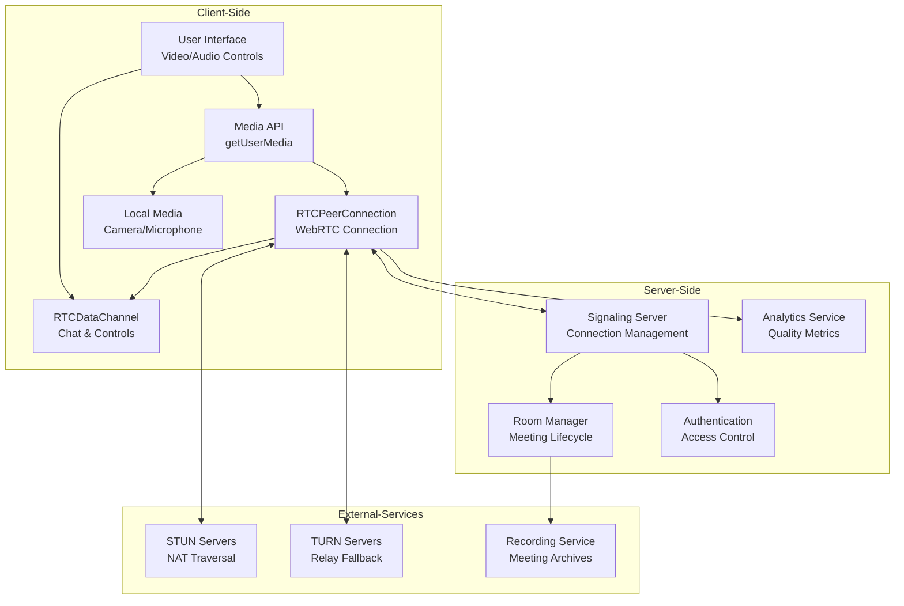
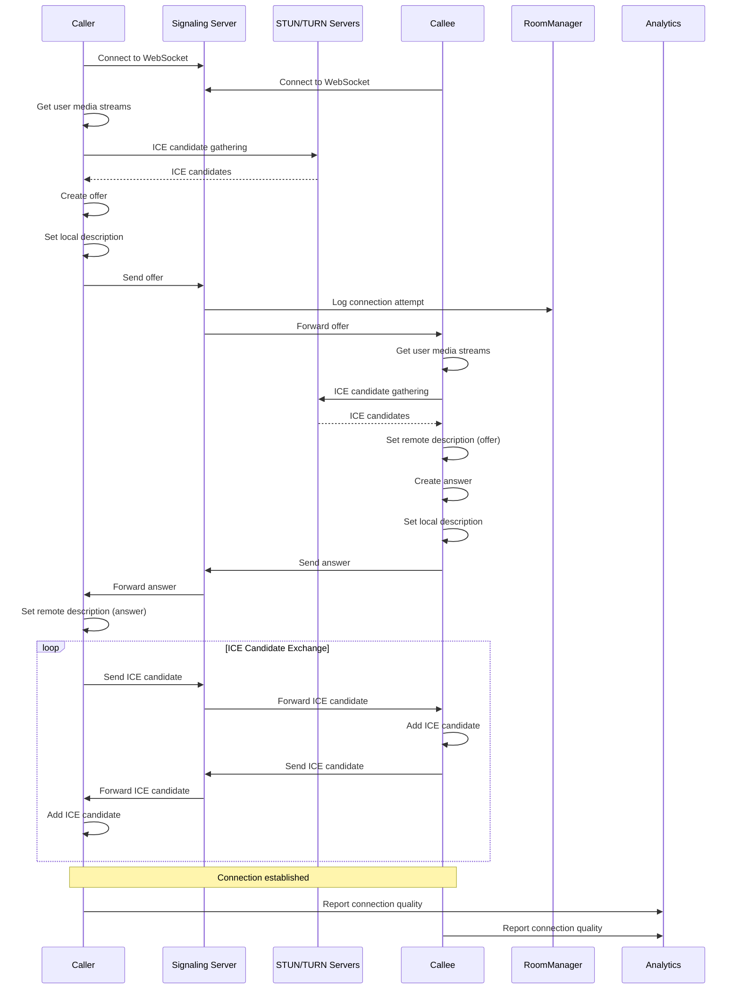
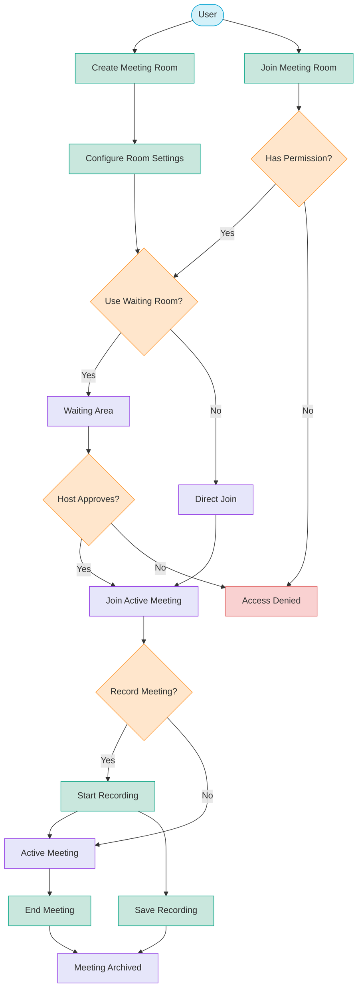
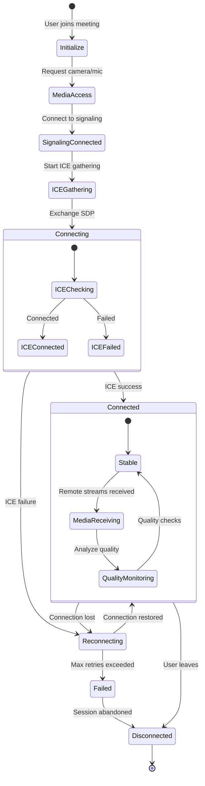

<!-- filepath: d:\projects\CSA\csa-hello\.docs\modules\meeting\module_diagram_extended.md -->
# Meeting Module Extended Diagrams

## WebRTC Architecture

## WebRTC Negotiation Sequence

## Meeting Room Management Flow

## Connection State Diagram

