# Meeting Module Sequence Diagrams

This documentation illustrates the real-time communication flows implemented in the Meeting Module, focusing on WebRTC connection establishment and signaling processes between clients.

```mermaid
sequenceDiagram
    participant Client1
    participant STUNTURNServer as STUN/TURN Servers
    participant Server
    participant Client2
    
    Note over Client1,Client2: WebSocket Connection Establishment
    
    Client1->>Server: Connect to WebSocket
    Server-->>Client1: Connection established
    Client1->>Server: JOIN message (clientId)
    
    Client2->>Server: Connect to WebSocket
    Server-->>Client2: Connection established
    Client2->>Server: JOIN message (clientId)
    
    Server->>Client1: Notify about Client2 (JOIN)
      Note over Client1,Client2: WebRTC Connection Establishment
    
    Client1->>Client1: Create RTCPeerConnection with ICE config
    Client1->>Client1: Get user media (audio/video)
    Client1->>Client1: Add local media tracks
    Client1->>Client1: Create offer (SDP)
    Client1->>Client1: Set local description
    Client1->>Server: Send OFFER to Client2 (with audioEnabled state)
    Server->>RoomManager: Validate permissions
    RoomManager-->>Server: Permission granted
    Server->>Client2: Forward OFFER (with Client1's audioEnabled)
    
    Client2->>Client2: Create RTCPeerConnection with ICE config
    Client2->>Client2: Add local media tracks
    Client2->>Client2: Set remote description (Client1's offer)
    Client2->>Client2: Create answer (SDP)
    Client2->>Client2: Set local description
    Client2->>Server: Send ANSWER to Client1 (with audioEnabled state)
    Server->>RoomManager: Log connection event
    Server->>Client1: Forward ANSWER (with Client2's audioEnabled)
    
    Client1->>Analytics: Report connection establishment
    
    Client1->>Client1: Set remote description (Client2's answer)
    
    Note over Client1,Client2: ICE Candidate Exchange & Connection Monitoring
    
    par ICE Candidate gathering and monitoring
        Client1->>STUNTURNServer: Get public IP (STUN request)
        STUNTURNServer-->>Client1: STUN response
        Client1->>Analytics: Log STUN server response time
        
        Client1->>Client1: Monitor ICE gathering state
        Client1->>Client1: Log detailed candidate information
        
        Client1->>RoomManager: Register connection state
        RoomManager->>RoomManager: Update room connection graph
        
        loop For each candidate (host, srflx, relay)
            Client1->>Server: Send CANDIDATE with type info
            Server->>Client2: Forward CANDIDATE
            Client2->>Client2: Add ICE candidate
            Client2->>Client2: Track connection state
        end
        
        Client2->>STUNTURNServer: Get public IP (STUN request)
        STUNTURNServer-->>Client2: STUN response
        
        Client2->>Client2: Monitor ICE gathering state
        Client2->>Client2: Log detailed candidate information
        
        loop For each candidate (host, srflx, relay)
            Client2->>Server: Send CANDIDATE with type info
            Server->>Client1: Forward CANDIDATE
            Client1->>Client1: Add ICE candidate
            Client1->>Client1: Track connection state
        end
    end
    
    Note over Client1,Client2: Advanced Connection Status Monitoring
      Client1->>Client1: Monitor connection state changes
    Client1->>Client1: Monitor ICE connection state
    Client1->>Client1: Detect failed connections
    
    Client2->>Client2: Monitor connection state changes
    Client2->>Client2: Monitor ICE connection state
    Client2->>Client2: Detect failed connections
      alt Connection established successfully
        Client1->>Client2: Media stream (audio/video)
        Client2->>Client1: Media stream (audio/video)
        Note over Client1,Client2: Bidirectional peer-to-peer media exchange
    else Connection fails (firewall/NAT issues)
        Client1->>STUNTURNServer: Request TURN relay
        Client2->>STUNTURNServer: Request TURN relay        Client1->>STUNTURNServer: Media stream to Client2
        STUNTURNServer->>Client2: Relay media from Client1
        Client2->>STUNTURNServer: Media stream to Client1
        STUNTURNServer->>Client1: Relay media from Client2
        Note over Client1,Client2: Media relayed through TURN server
    end
    
    Note over Client1,Client2: Media Handling & Autoplay
    
    Client1->>Client1: Handle remote track events
    Client1->>Client1: Set video metadata loaded handler
    Client1->>Client1: Handle autoplay restrictions
    
    Client2->>Client2: Handle remote track events
    Client2->>Client2: Set video metadata loaded handler
    Client2->>Client2: Handle autoplay restrictions
    
    Note over Client1,Client2: Media Control & Chat
    
    Client1->>Server: AUDIO_TOGGLE (enabled/disabled)
    Server->>Client2: Forward AUDIO_TOGGLE
    Client2->>Client2: Update remote audio state
    
    Client2->>Server: VIDEO_TOGGLE (enabled/disabled)
    Server->>Client1: Forward VIDEO_TOGGLE
    Client1->>Client1: Update remote video state
    
    Client1->>Server: CHAT_MESSAGE
    Server->>Client2: Forward CHAT_MESSAGE
    Client2->>Client2: Display chat message
    
    Note over Client1,Client2: Connection Termination
    
    Client1->>Server: LEAVE
    Server->>Client2: Notify about Client1 leaving
    Client2->>Client2: Remove Client1's stream
    Server->>Server: Clean up resources
```

## WebRTC Connection Flow Explained

### Connection Establishment

1. **WebSocket Setup**:
   - Both clients establish WebSocket connections with the server
   - Clients send JOIN messages to register in a specific room

2. **Offer/Answer Exchange**:
   - When a new client joins, existing clients create offers
   - The offer contains Session Description Protocol (SDP) information
   - The receiver sets this as remote description and creates an answer
   - The answer is sent back to complete the SDP exchange

3. **ICE Candidate Exchange**:
   - Both peers gather ICE candidates (potential connection methods)
   - Candidates include different connection types (host, srflx, relay)
   - Candidates are exchanged via the signaling server
   - Each peer adds the other's candidates to try various connection paths

4. **Connection Establishment**:
   - Once a viable path is found, connection is established
   - Media starts flowing directly between peers (if possible)
   - TURN servers are used as relay if direct connection fails

### Media Control

- **Audio/Video Toggle**:
  - Clients can mute/unmute audio or enable/disable video
  - These state changes are broadcast to other participants
  - Remote streams are updated to reflect these changes

- **Chat Messaging**:
  - Text messages are sent through the signaling server
  - Messages are displayed in the chat panel on all clients

### Connection Termination

- When a client leaves, a LEAVE message is sent
- Other clients remove the departed client's media stream
- The server cleans up associated resources

## Detailed All Steps of WebRTC Connection Establishment

### Step 1: WebSocket Connection Establishment
- **Client1** initiates a WebSocket connection to the **Server**.
- The **Server** acknowledges the connection and sends a confirmation message back to **Client1**.
- **Client1** sends a JOIN message to the **Server** with its client ID.

### Step 2: Client2 Connection Establishment
- **Client2** initiates a WebSocket connection to the **Server**.
- The **Server** acknowledges the connection and sends a confirmation message back to **Client2**.
- **Client2** sends a JOIN message to the **Server** with its client ID.

### Step 3: Notify Client1 about Client2
- The **Server** notifies **Client1** about the new connection of **Client2**.
- **Client1** receives the notification and prepares to establish a WebRTC connection with **Client2**.
