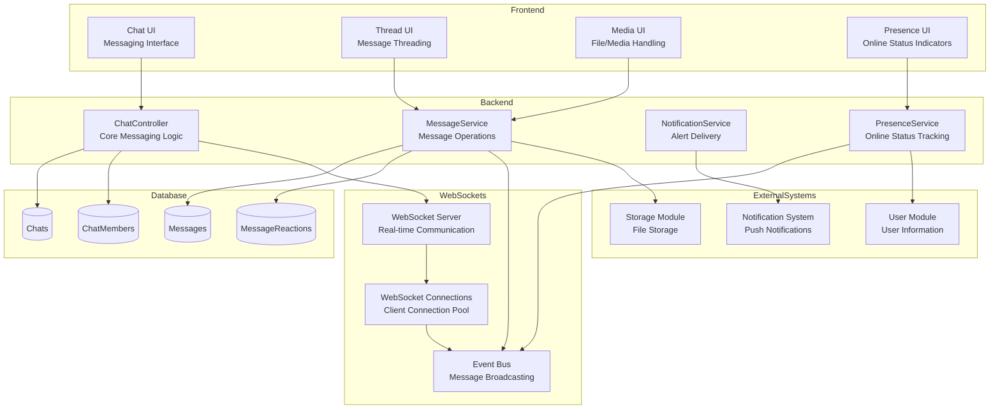
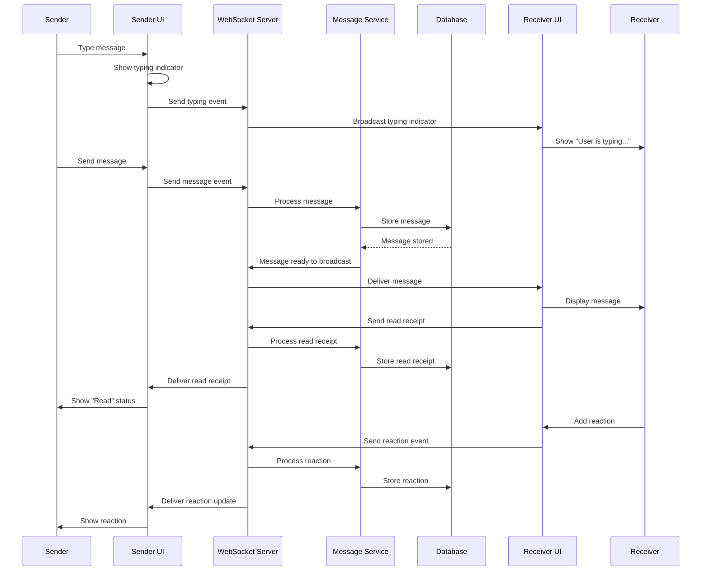
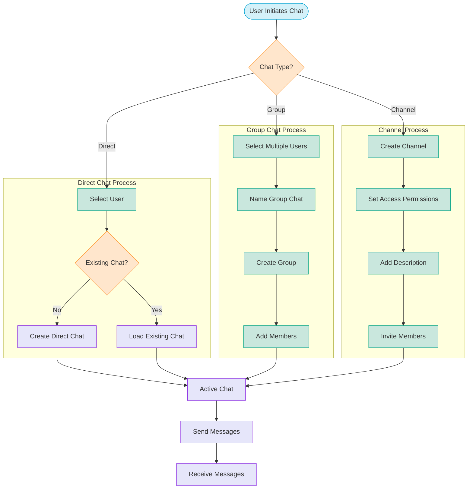
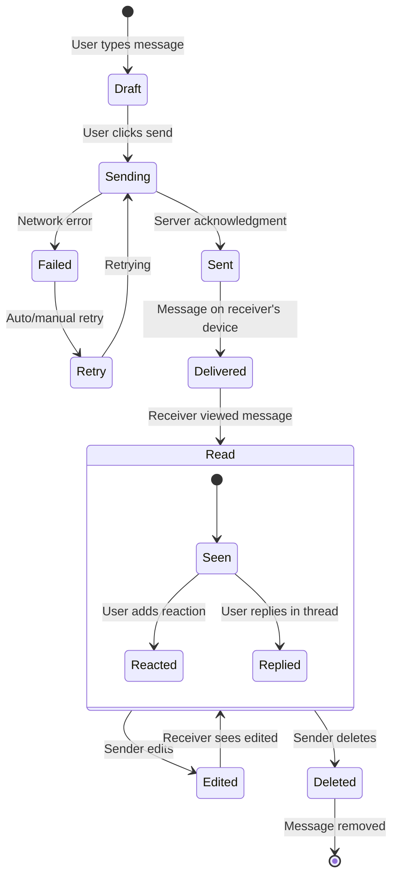

<!-- filepath: d:\projects\CSA\csa-hello\.docs\modules\messenger\module_diagram.md -->
# Messenger Module Diagrams

## Component Architecture

## Chat Message Sequence

## Chat Types Flow Diagram

## Message State Diagram

