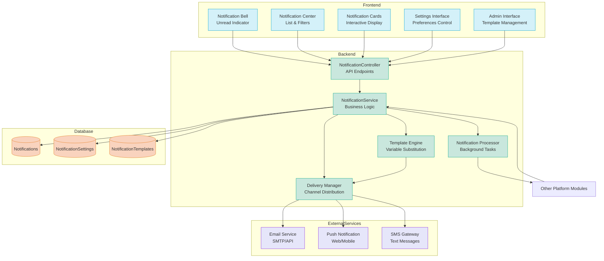
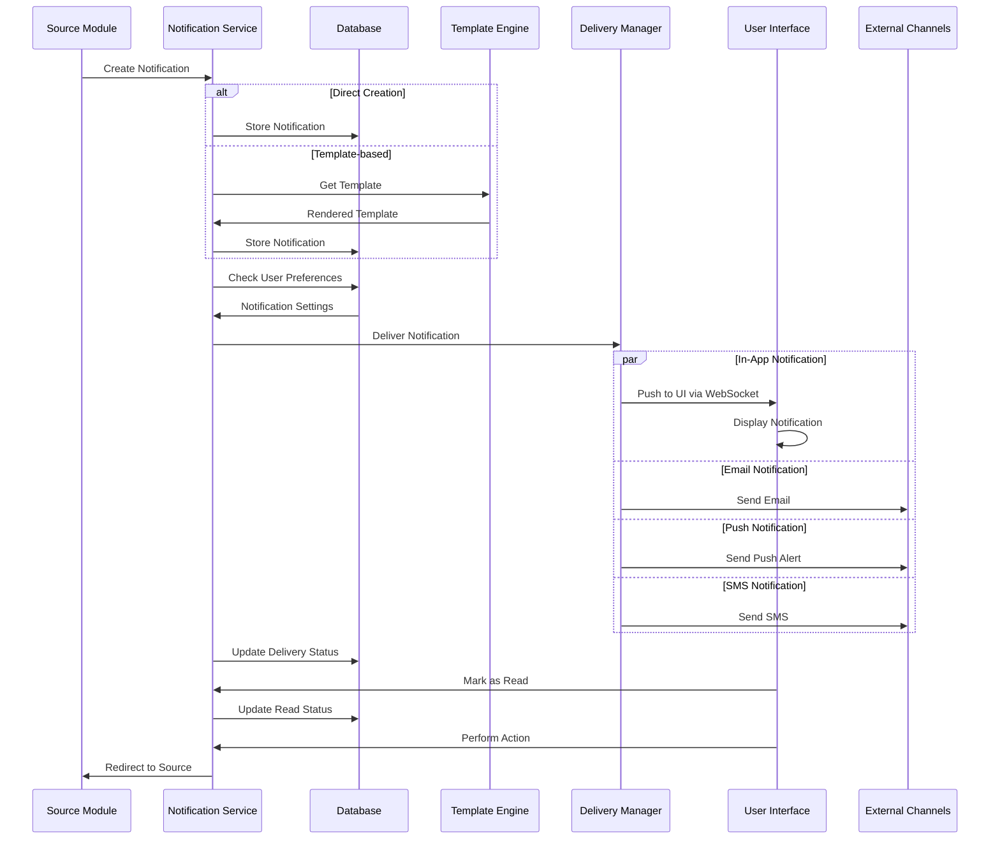
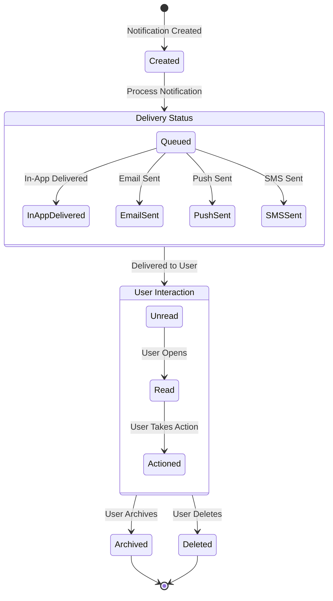
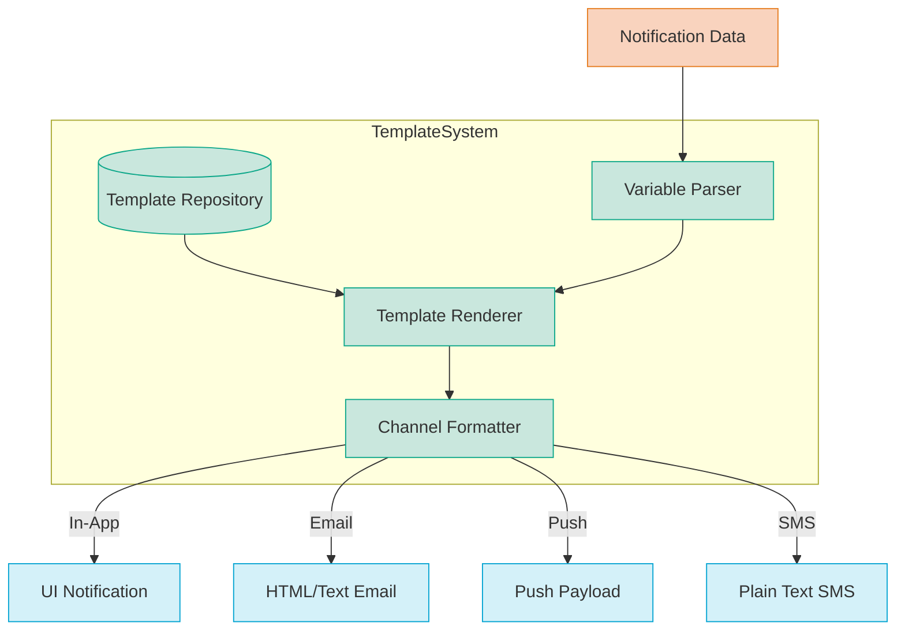
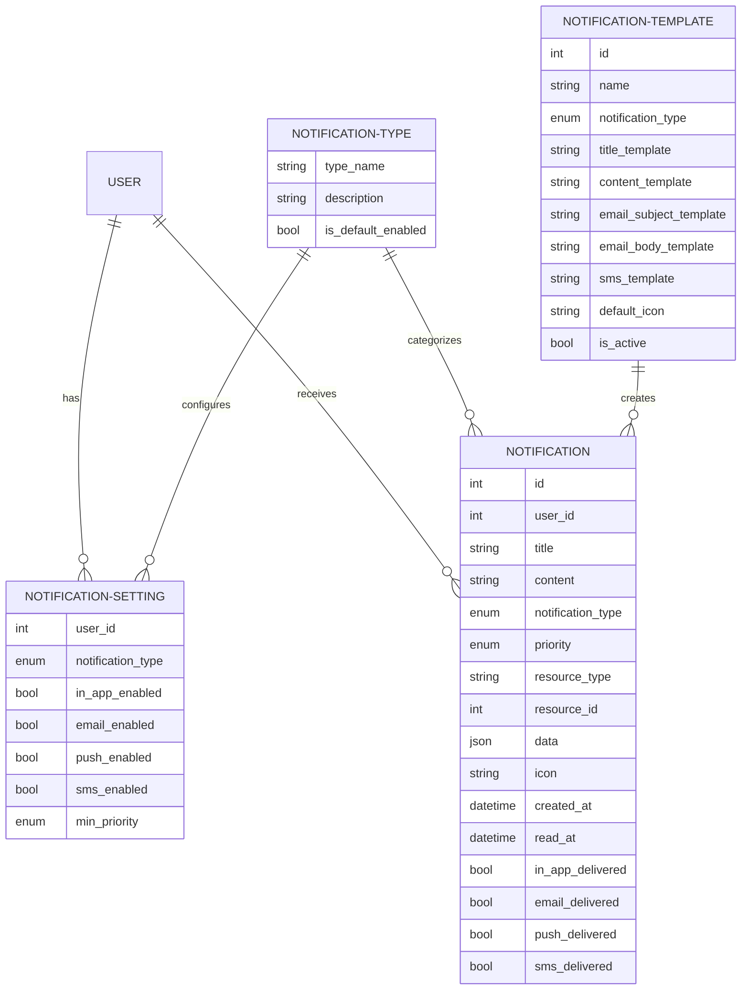

# Notification Module Diagrams

## Component Architecture



## Notification Flow Sequence Diagram



## Notification Delivery Flow

```mermaid
flowchart TD
    Start([New Notification]) --> CreateNotif[Create Notification]
    CreateNotif --> CheckSettings{Check User Settings}
    
    CheckSettings -->|Get Preferences| UserPrefs[User Notification Preferences]
    UserPrefs --> FilterByType{Filter By Type}
    
    FilterByType -->|Disabled| Skip[Skip Notification]
    FilterByType -->|Enabled| CheckPriority{Check Priority}
    
    CheckPriority -->|Below Threshold| Skip
    CheckPriority -->|Meets Threshold| CheckChannels{Select Delivery Channels}
    
    CheckChannels -->|In-App Enabled| InApp[Deliver In-App Notification]
    CheckChannels -->|Email Enabled| Email[Send Email Notification]
    CheckChannels -->|Push Enabled| Push[Send Push Notification]
    CheckChannels -->|SMS Enabled| SMS[Send SMS Notification]
    
    InApp --> UpdateStatus[Update Delivery Status]
    Email --> UpdateStatus
    Push --> UpdateStatus
    SMS --> UpdateStatus
    
    UpdateStatus --> End([Notification Processed])
    Skip --> End
    
    classDef start fill:#e5f8e5,stroke:#3c763d
    classDef process fill:#e3f2fd,stroke:#1565c0
    classDef decision fill:#fff8e1,stroke:#ff8f00
    classDef end fill:#f9d1d1,stroke:#e06666
    
    class Start start
    class CreateNotif,UserPrefs,InApp,Email,Push,SMS,UpdateStatus process
    class CheckSettings,FilterByType,CheckPriority,CheckChannels decision
    class End,Skip end
```

## Notification State Diagram



## Template System Architecture



## User Preference Model


