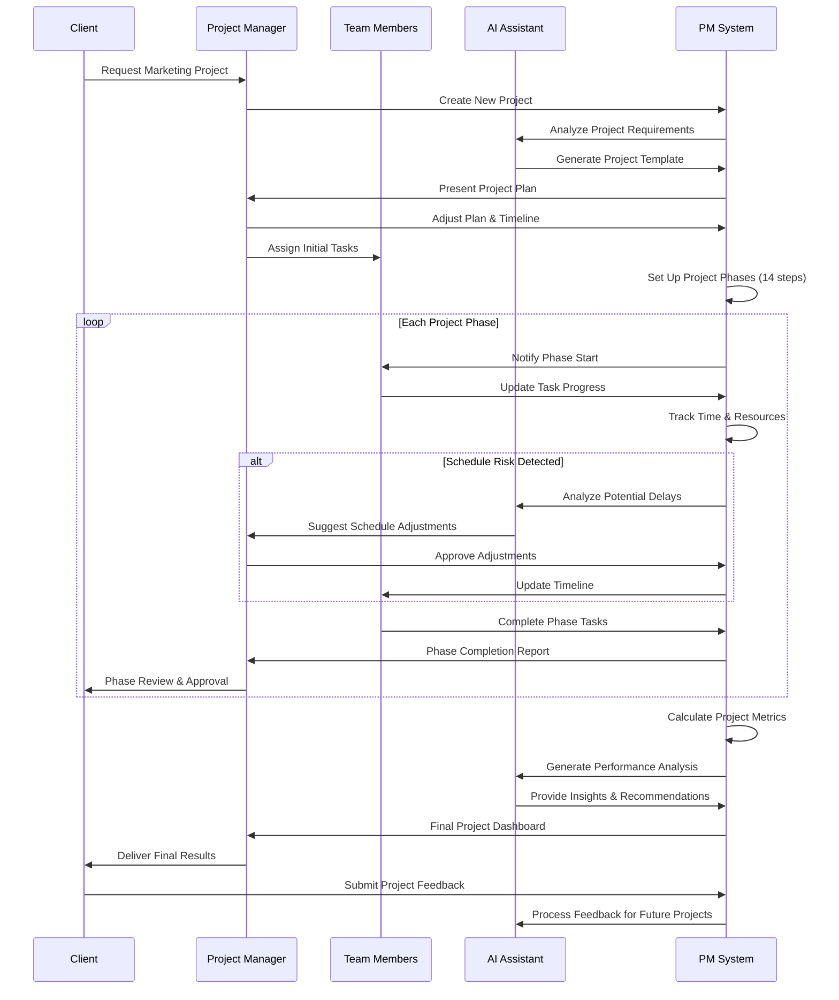
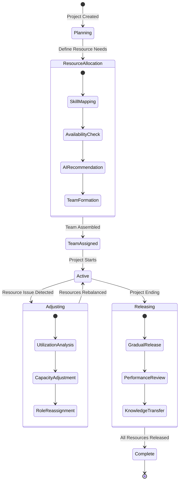

<!-- filepath: d:\projects\CSA\csa-hello\.docs\modules\project_management\module_diagram.md -->
# Project Management Module Diagrams

## Component Architecture

```mermaid
graph TD
    subgraph Frontend
        ProjectUI["Project UI<br>Project Dashboard"]
        TaskUI["Task UI<br>Task Management"]
        TimelineUI["Timeline UI<br>Gantt Charts"]
        ResourceUI["Resource UI<br>Team Management"]
        AnalyticsUI["Analytics UI<br>Project Metrics"]
    end
    
    subgraph Backend
        ProjectController["ProjectController<br>Core Project Logic"]
        TaskService["TaskService<br>Task Operations"]
        ResourceService["ResourceService<br>Team Management"]
        TimelineService["TimelineService<br>Schedule Management"]
        AIService["AI Service<br>Intelligent Assistance"]
    end
    
    subgraph Database
        ProjectDB[(Projects)]
        TaskDB[(Tasks)]
        ResourceDB[(Resources)]
        TimelineDB[(Timelines)]
        DocumentDB[(ProjectDocuments)]
    end
    
    ProjectUI --> ProjectController
    TaskUI --> TaskService
    TimelineUI --> TimelineService
    ResourceUI --> ResourceService
    AnalyticsUI --> ProjectController
    
    ProjectController --> ProjectDB
    TaskService --> TaskDB
    ResourceService --> ResourceDB
    TimelineService --> TimelineDB
    ProjectController --> DocumentDB
    
    AIService --> TaskService
    AIService --> TimelineService
    AIService --> ProjectController
    
    subgraph ExternalSystems
        Calendar["Calendar Module<br>Schedule Integration"]
        Document["Document Module<br>Project Files"]
        Notification["Notification System<br>Alerts & Reminders"]
        ClientPortal["Client Portal<br>Client Access"]
        Finance["Finance System<br>Budget Tracking"]
    end
    
    TimelineService --> Calendar
    ProjectController --> Document
    ProjectController --> Notification
    ProjectController --> ClientPortal
    ProjectController --> Finance
```

## Marketing Project Workflow Sequence

## 14-Step Marketing Process Flow

```mermaid
flowchart TD
    Start([Project Initiation])
    
    subgraph Kickoff [Phase 1: Kickoff]
        Step1[Step 1: Client Brief]
        Step2[Step 2: Market Research]
        Step3[Step 3: Competitor Analysis]
        Step4[Step 4: Target Audience Definition]
        Step5[Step 5: Initial Strategy Meeting]
    end
    
    subgraph Planning [Phase 2: Planning]
        Step6[Step 6: Comprehensive Marketing Plan]
    end
    
    subgraph Execution [Phase 3: Execution]
        Step7[Step 7: Content Creation]
        Step8[Step 8: Design Development]
        Step9[Step 9: Platform Setup]
        Step10[Step 10: Campaign Launch]
    end
    
    subgraph Monitoring [Phase 4: Monitoring]
        Step11[Step 11: Performance Tracking]
        Step12[Step 12: Mid-Campaign Adjustments]
    end
    
    subgraph Evaluation [Phase 5: Evaluation]
        Step13[Step 13: Results Analysis]
        Step14[Step 14: Final Client Review]
    end
    
    Start --> Step1
    Step1 --> Step2
    Step2 --> Step3
    Step3 --> Step4
    Step4 --> Step5
    Step5 --> Step6
    Step6 --> Step7
    Step7 --> Step8
    Step8 --> Step9
    Step9 --> Step10
    Step10 --> Step11
    Step11 --> Step12
    Step12 --> Step13
    Step13 --> Step14
    Step14 --> Complete([Project Completion])
    
    %% Client Approval Points
    Step6 -.-> ClientApproval1{Client<br>Approval}
    Step10 -.-> ClientApproval2{Client<br>Approval}
    Step14 -.-> ClientApproval3{Client<br>Approval}
    
    ClientApproval1 -.->|Approved| Step7
    ClientApproval1 -.->|Revisions| Step6
    ClientApproval2 -.->|Approved| Step11
    ClientApproval2 -.->|Adjustments| Step10
    ClientApproval3 -.->|Approved| Complete
    ClientApproval3 -.->|Revisions| Step13
    
    classDef phase1 fill:#ffecb3,stroke:#ff9800
    classDef phase2 fill:#c8e6c9,stroke:#4caf50
    classDef phase3 fill:#bbdefb,stroke:#2196f3
    classDef phase4 fill:#e1bee7,stroke:#9c27b0
    classDef phase5 fill:#ffcdd2,stroke:#f44336
    classDef milestone fill:#d4f1f9,stroke:#05a4d2
    classDef approval fill:#ffe6cc,stroke:#ff9933
    
    class Step1,Step2,Step3,Step4,Step5 phase1
    class Step6 phase2
    class Step7,Step8,Step9,Step10 phase3
    class Step11,Step12 phase4
    class Step13,Step14 phase5
    class Start,Complete milestone
    class ClientApproval1,ClientApproval2,ClientApproval3 approval
```

## Resource Allocation State Diagram

