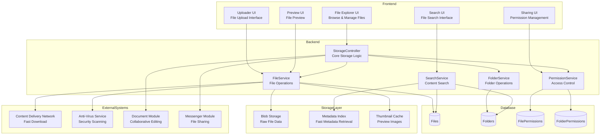
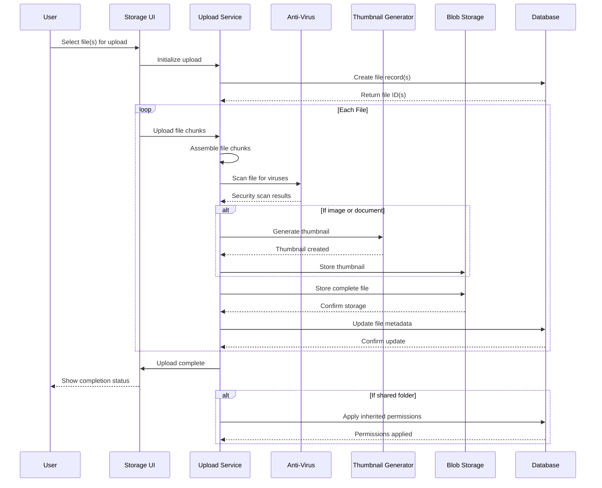
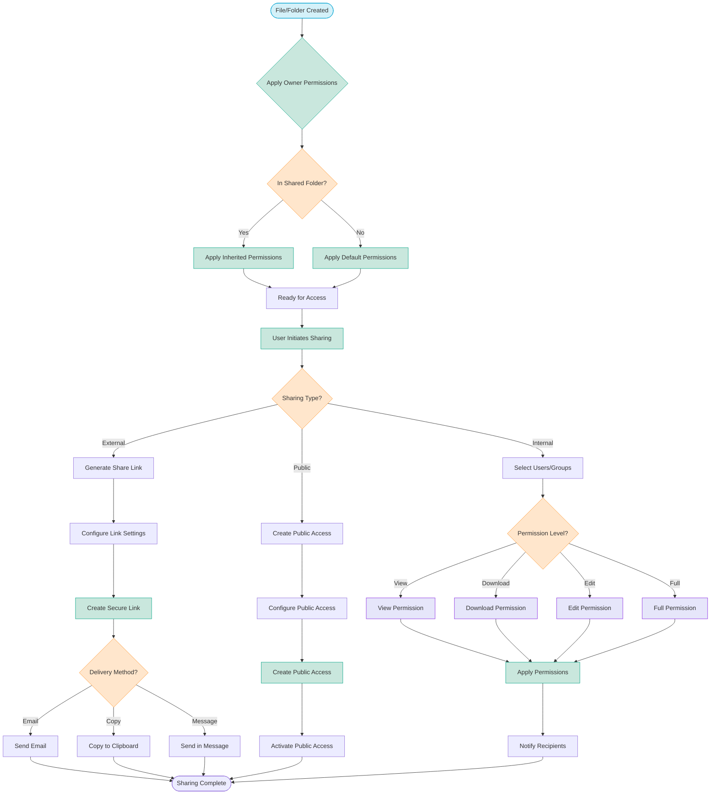
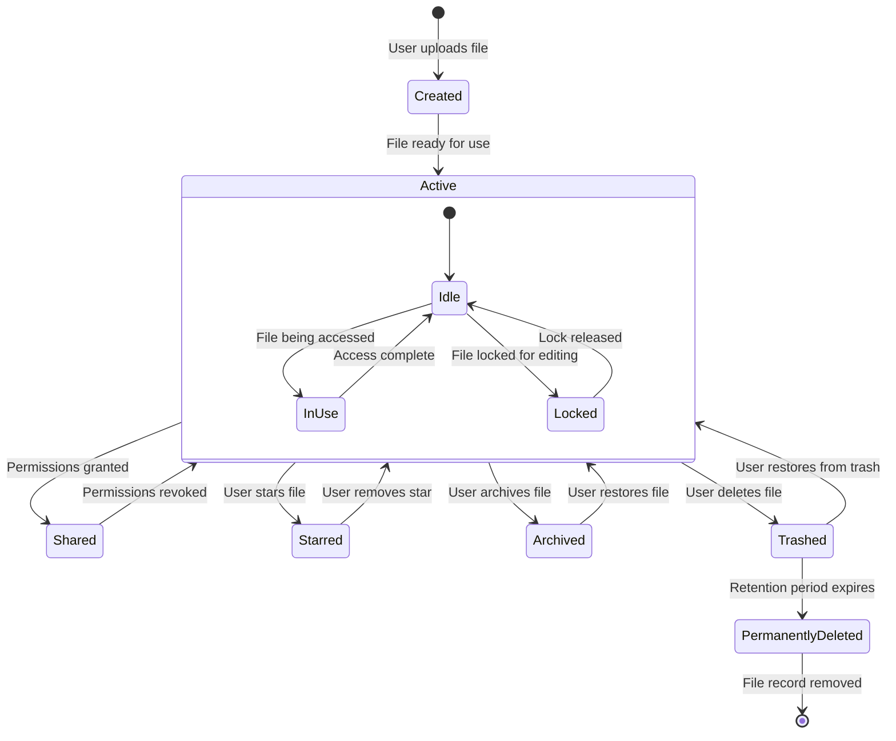

<!-- filepath: d:\projects\CSA\csa-hello\.docs\modules\storage\module_diagram.md -->
# Storage Module Diagrams

## Component Architecture

## File Upload and Processing Sequence

## File Permission and Sharing Flow

## File Lifecycle State Diagram

