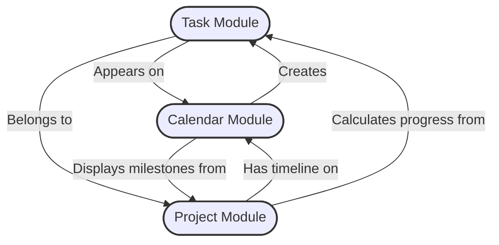
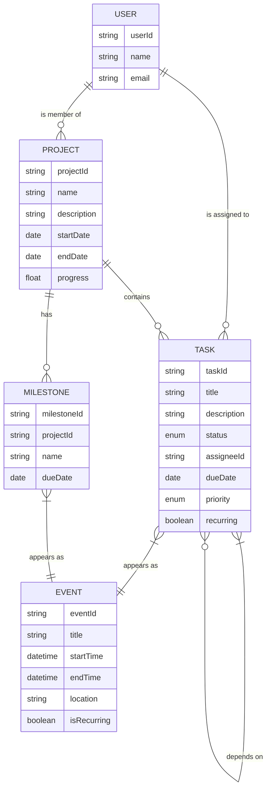
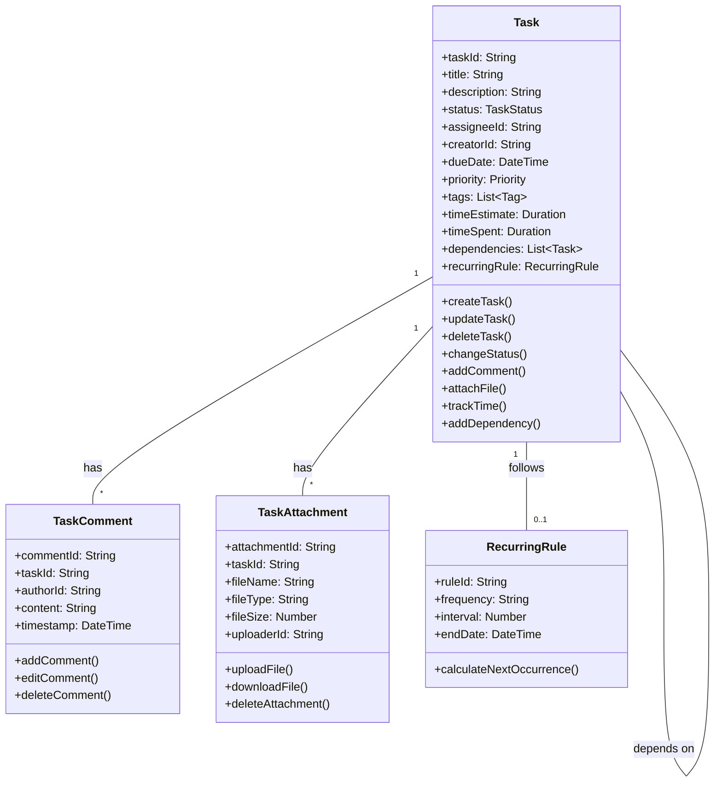
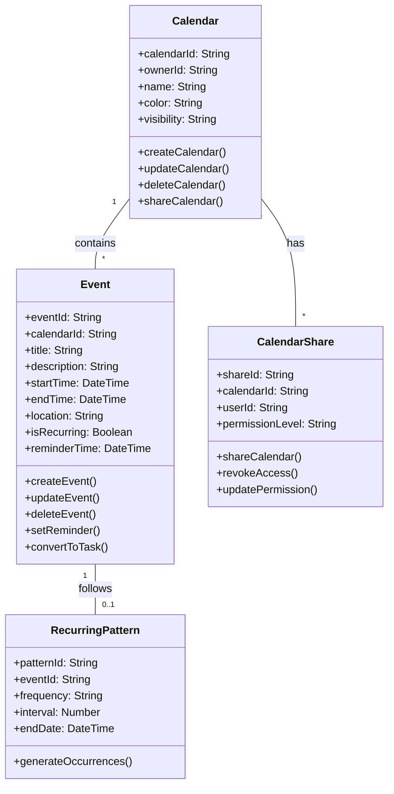
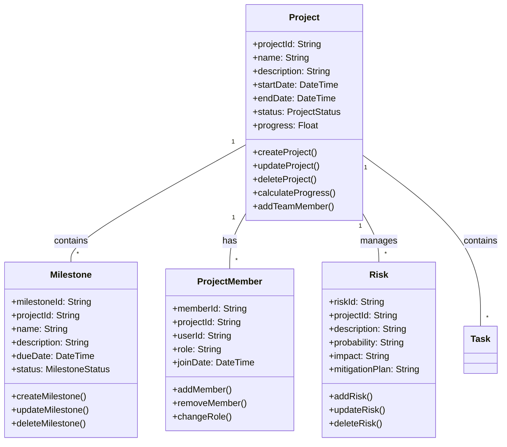
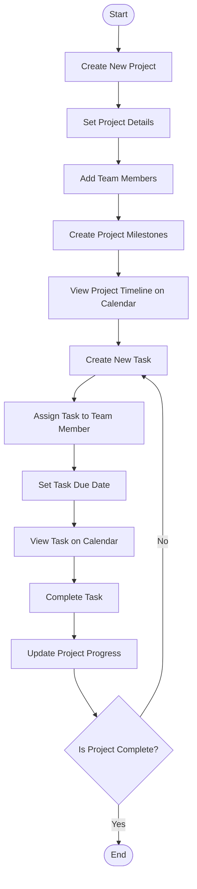
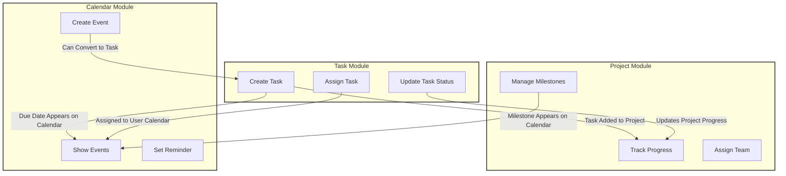

# Task, Calendar, and Project Modules - Diagrams

This document contains visual representations of the requirements and relationships between the Task, Calendar, and Project modules as specified in the requirements.

## Module Relationships Diagram

## Entity Relationship Diagram

## Task Module Class Diagram

## Calendar Module Class Diagram

## Project Module Class Diagram

## User Flow Diagram

## Integration Points Visualization

