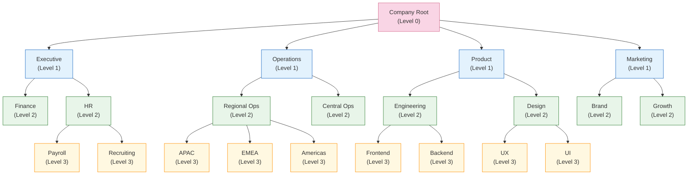
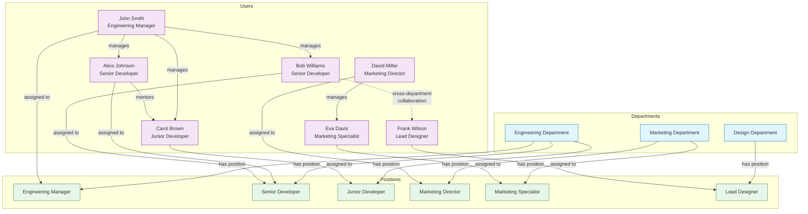
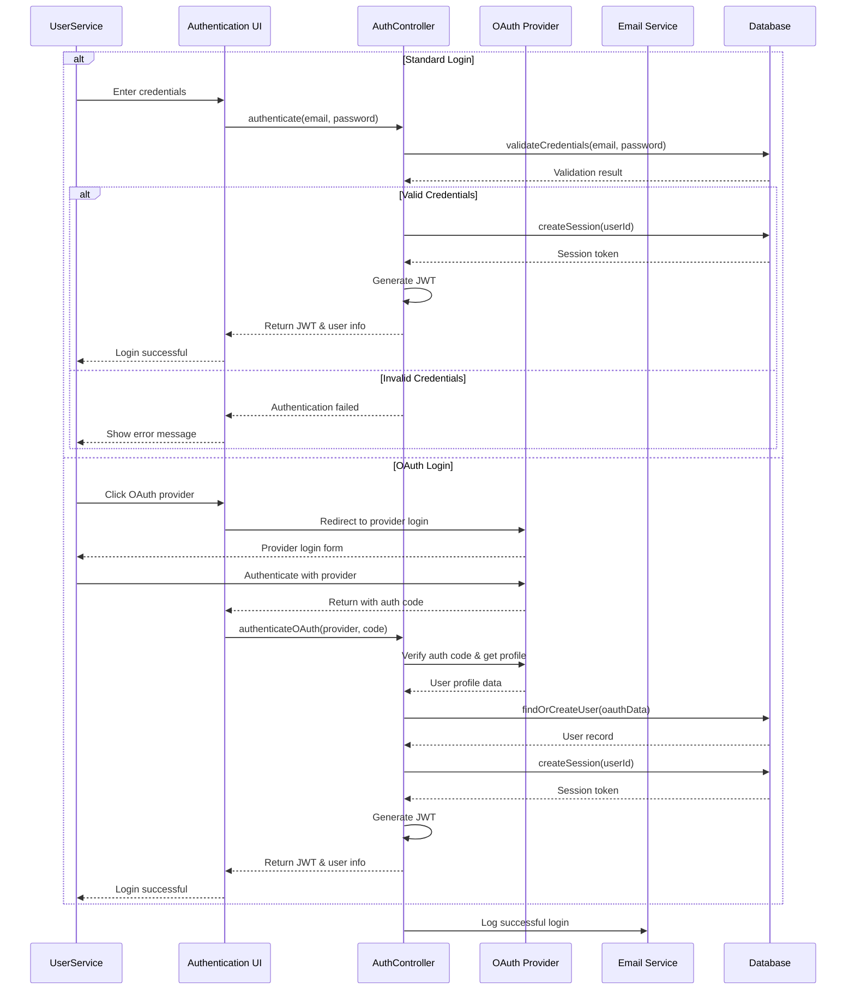
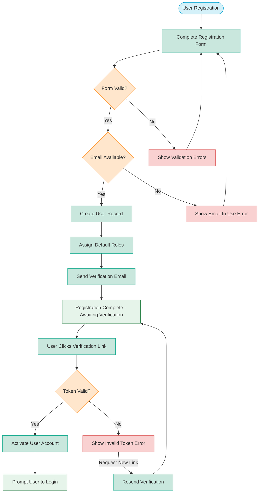
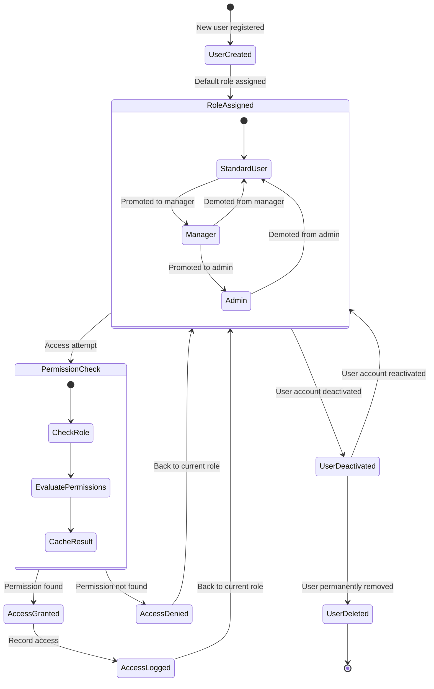

<!-- filepath: d:\projects\CSA\csa-hello\.docs\modules\user\module_diagram.md -->
# User Module Diagrams

## Component Architecture

```mermaid
graph TD
    subgraph Frontend
        AuthUI["Authentication UI<br>Login & Registration"]
        ProfileUI["Profile UI<br>User Profile Management"]
        AdminUI["Admin UI<br>User Administration"]
        PermissionUI["Permission UI<br>Role Management"]
        PreferenceUI["Preference UI<br>User Settings"]
        OrgChartUI["Organization Chart UI<br>Department Visualization"]
        DeptUI["Department Management UI<br>Structure Administration"]
        PositionUI["Position Management UI<br>Role Administration"]
    end
      subgraph Backend
        AuthController["AuthController<br>Authentication Logic"]
        UserController["UserController<br>User Management"]
        RoleService["RoleService<br>Role & Permission Management"]
        ProfileService["ProfileService<br>Profile Management"]
        ActivityService["ActivityService<br>User Activity Tracking"]
        DepartmentService["DepartmentService<br>Department Hierarchy Management"]
        PositionService["PositionService<br>Position Management"]
        OrgChartService["OrgChartService<br>Organizational Visualization"]
        SyncService["SynchronizationService<br>HR System Integration"]
    end
    
    subgraph Database
        UserDB[(Users)]
        ProfileDB[(UserProfiles)]
        RoleDB[(Roles)]
        PermissionDB[(Permissions)]
        SessionDB[(Sessions)]
        ActivityLogDB[(ActivityLogs)]
        DepartmentDB[(Departments)]
        PositionDB[(Positions)]
        DeptMembershipDB[(DepartmentMemberships)]
        HierarchyDB[(DepartmentHierarchy)]
    end
      AuthUI --> AuthController
    ProfileUI --> ProfileService
    AdminUI --> UserController
    PermissionUI --> RoleService
    PreferenceUI --> ProfileService
    OrgChartUI --> OrgChartService
    DeptUI --> DepartmentService
    PositionUI --> PositionService
    
    AuthController --> UserDB
    AuthController --> SessionDB
    
    UserController --> UserDB
    UserController --> RoleDB
    UserController --> DepartmentDB
    UserController --> PositionDB
    
    ProfileService --> ProfileDB
    ProfileService --> UserDB
    
    RoleService --> RoleDB
    RoleService --> PermissionDB
    
    ActivityService --> ActivityLogDB
    
    DepartmentService --> DepartmentDB
    DepartmentService --> HierarchyDB
    DepartmentService --> UserDB
    DepartmentService --> DeptMembershipDB
    
    PositionService --> PositionDB
    PositionService --> UserDB
    PositionService --> DepartmentDB
    
    OrgChartService --> DepartmentDB
    OrgChartService --> PositionDB
    OrgChartService --> UserDB
    OrgChartService --> HierarchyDB
    
    SyncService --> DepartmentDB
    SyncService --> PositionDB
    SyncService --> UserDB
    
    AuthController --> ActivityService
    UserController --> ActivityService
    ProfileService --> ActivityService
    DepartmentService --> ActivityService
    PositionService --> ActivityService
    
    subgraph ExternalSystems
        OAuth["OAuth Providers<br>External Authentication"]
        EmailService["Email Service<br>Verification & Notifications"]
        AuditSystem["Audit System<br>Security Logging"]
        PermissionCaches["Permission Cache<br>Fast Permission Checks"]
    end
    
    AuthController --> OAuth
    AuthController --> EmailService
    ActivityService --> AuditSystem    RoleService --> PermissionCaches
    DepartmentService --> ExternalSystems
```

## Department Hierarchy Model



## Department-User Relationship Model



## Authentication Sequence Diagram



## User Registration and Verification Flow



## Role-based Access Control Model


