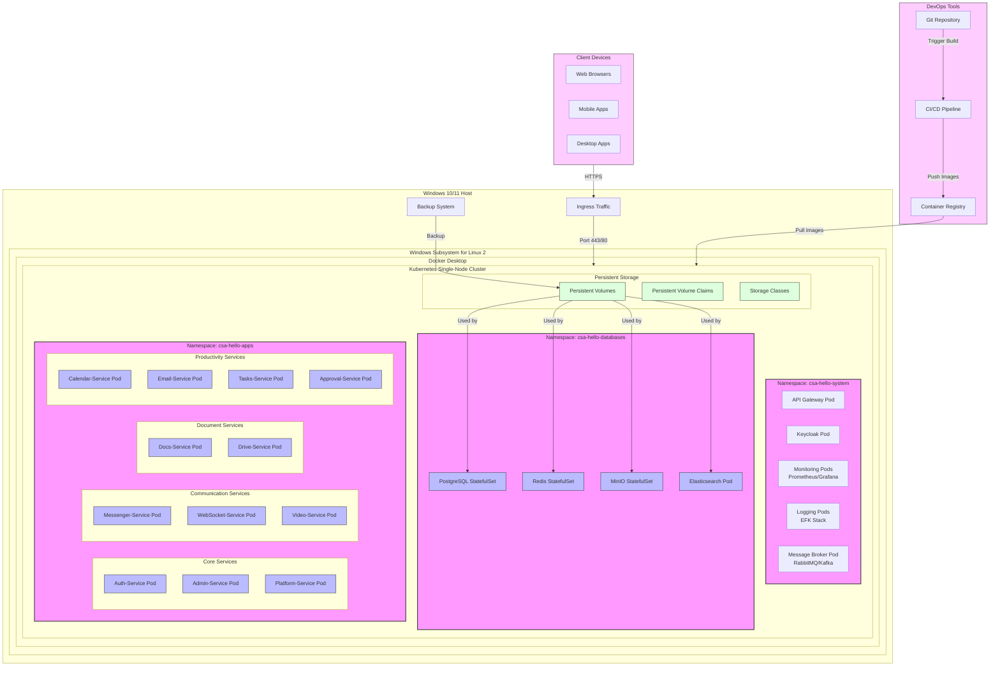
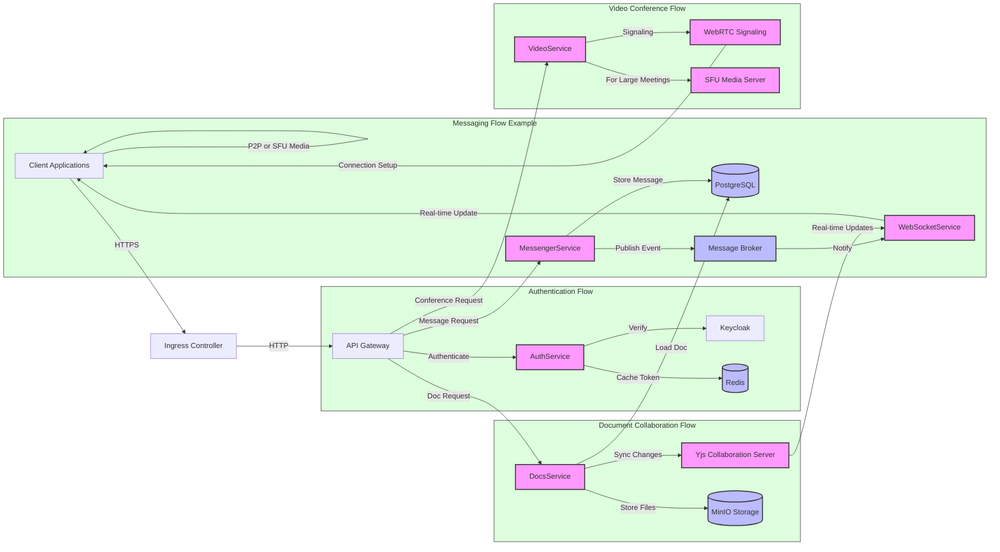
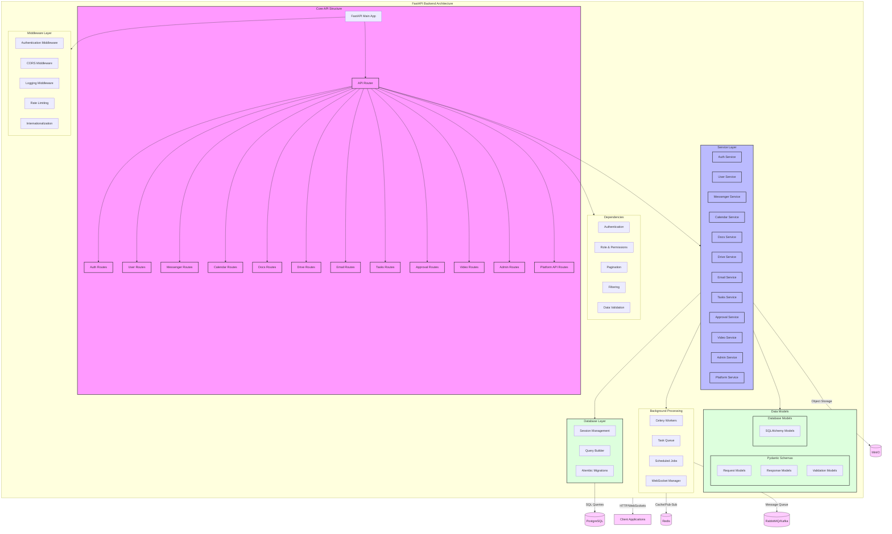
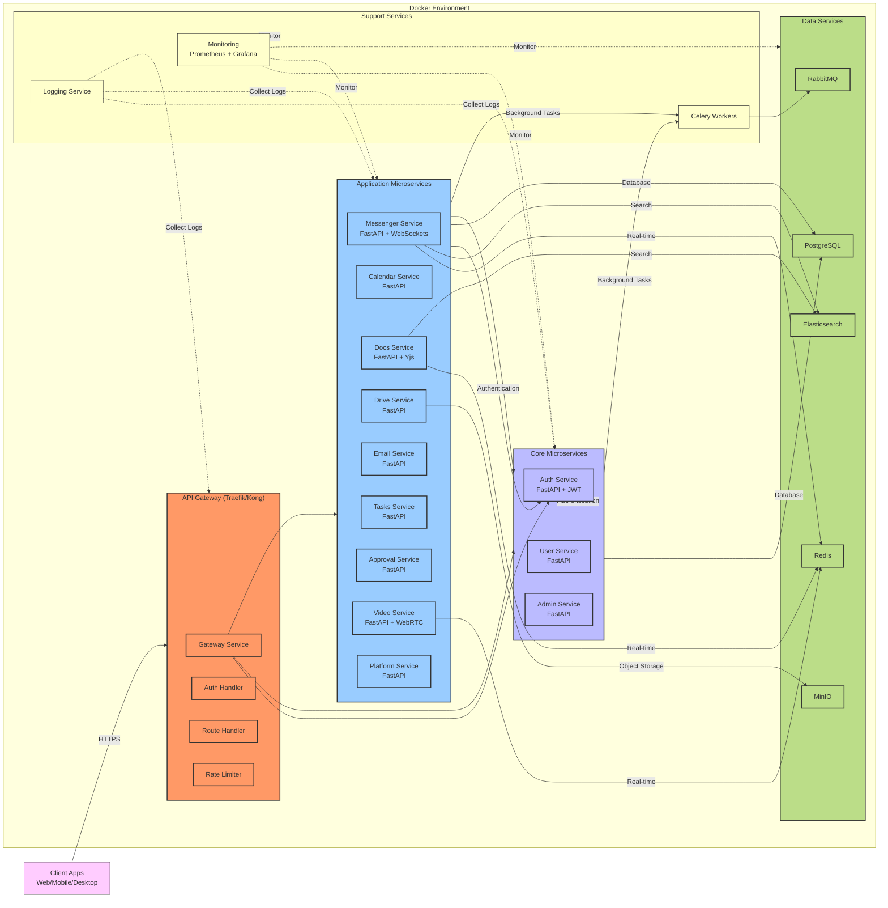

# Summary Diagram (Conceptual)

```
+---------------------+     +---------------------+     +---------------------+
|     Web Client      |     |   Mobile Clients    |     |  Desktop Clients    |
| (React + TypeScript)|     | (Flutter/React Native) |   | (Tauri + React)    |
+---------------------+     +---------------------+     +---------------------+
            |                           |                          |
            +---------------------------+--------------------------+
                                        |
                                +------------------+
                                |    Ingress       | (NGINX Ingress Controller)
                                +------------------+
                                        |
+-----------------------------------------------------------------------------+
| Windows Server (Windows 10/11 Pro) với Docker Desktop & Kubernetes          |
|                                                                             |
|    +-----------------------------------------------------------------+     |
|    |                   Kubernetes Cluster (Single-node)               |     |
|    |                                                                   |     |
|    |  +----------------+  +----------------+                          |     |
|    |  | API Gateway    |  | Service Mesh   |                          |     |
|    |  | (Kong/Traefik) |  | (Istio/Linkerd)|                          |     |
|    |  +----------------+  +----------------+                          |     |
|    |                                                                   |     |
|    |  +----------------+  +----------------+  +----------------+      |     |
|    |  | Auth-Service   |  | Messenger-     |  | Calendar-      |      |     |
|    |  | Container      |  | Service         |  | Service        |      |     |
|    |  +----------------+  +----------------+  +----------------+      |     |
|    |                                                                   |     |
|    |  +----------------+  +----------------+  +----------------+      |     |
|    |  | Docs-Service   |  | Drive-Service  |  | Email-Service  |      |     |
|    |  | Container      |  | Container      |  | Container      |      |     |
|    |  +----------------+  +----------------+  +----------------+      |     |
|    |                                                                   |     |
|    |  +----------------+  +----------------+  +----------------+      |     |
|    |  | Tasks-Service  |  | Approval-      |  | Video-Service  |      |     |
|    |  | Container      |  | Service        |  | Container      |      |     |
|    |  +----------------+  +----------------+  +----------------+      |     |
|    |                                                                   |     |
|    |  +----------------+  +----------------+  +----------------+      |     |
|    |  | Admin-Service  |  | Platform-      |  | WebSocket      |      |     |
|    |  | Container      |  | Service        |  | Service        |      |     |
|    |  +----------------+  +----------------+  +----------------+      |     |
|    |                                                                   |     |
|    |  +-----------------------+  +--------------------------------+   |     |
|    |  | Message Broker        |  |     Background Tasks           |   |     |
|    |  | (RabbitMQ/Kafka)      |  |     Containers                 |   |     |
|    |  +-----------------------+  +--------------------------------+   |     |
|    |                                                                   |     |
|    |  +-----------------------+  +--------------------------------+   |     |
|    |  | Monitoring & Logging  |  |     CI/CD Pipeline              |   |     |
|    |  | (Prometheus, EFK)     |  |     (GitHub Actions/GitLab CI)  |   |     |
|    |  +-----------------------+  +--------------------------------+   |     |
|    +-----------------------------------------------------------------+     |
|                                                                             |
|    +-----------------+  +---------------+  +------------------+             |
|    |   PostgreSQL    |  |  Redis Cache  |  |   MinIO Object   |             |
|    |    Container    |  |   Container   |  |  Storage Container|             |
|    +-----------------+  +---------------+  +------------------+             |
|                                                                             |
|    +-----------------+  +---------------+                                   |
|    |  PgBouncer      |  | Elasticsearch |                                   |
|    |   Container     |  |  Container    |                                   |
|    +-----------------+  +---------------+                                   |
|                                                                             |
|    +----------------------------------------------------------------------+ |
|    |                      Persistent Volumes (Kubernetes PV)               | |
|    +----------------------------------------------------------------------+ |
|                                                                             |
+-----------------------------------------------------------------------------+
```

## Kubernetes Architecture Diagram

```mermaid
flowchart TD
    %% External Access
    Internet((Internet)) -->|HTTPS| IngressController[NGINX Ingress Controller]
    
    %% API Gateway
    IngressController -->|HTTP| ApiGateway[API Gateway\nKong/Traefik]
    
    %% Auth Flow
    ApiGateway --> AuthService[Auth-Service Pod]
    AuthService --> Keycloak[Keycloak Container\nOAuth2/OIDC Provider]
    
    %% Main Services
    ApiGateway --> MessengerService[Messenger-Service Pod]
    ApiGateway --> CalendarService[Calendar-Service Pod]
    ApiGateway --> DocsService[Docs-Service Pod]
    ApiGateway --> DriveService[Drive-Service Pod]
    ApiGateway --> EmailService[Email-Service Pod]
    ApiGateway --> TasksService[Tasks-Service Pod]
    ApiGateway --> ApprovalService[Approval-Service Pod]
    ApiGateway --> VideoService[Video-Service Pod]
    ApiGateway --> AdminService[Admin-Service Pod]
    ApiGateway --> PlatformService[Platform-Service Pod]
    ApiGateway --> WebsocketService[WebSocket-Service Pod]
    
    %% Databases & Storage
    PostgreSQL[(PostgreSQL StatefulSet)] <--> PgBouncer[PgBouncer Pod]
    Redis[(Redis StatefulSet)] <--> CacheService[Cache Service]
    MinIO[(MinIO Object Storage)] <--> DriveService
    MinIO <--> DocsService
    
    %% Auth connects to all services
    AuthService -.->|Authentication| MessengerService & CalendarService & DocsService & DriveService & EmailService & TasksService & ApprovalService & VideoService & AdminService & PlatformService
    
    %% Message broker
    MessageBroker[Message Broker\nRabbitMQ/Kafka] <--> MessengerService & CalendarService & DocsService & DriveService & EmailService & TasksService & ApprovalService & VideoService & AdminService
    
    %% WebSocket connections
    WebsocketService <--> MessengerService
    WebsocketService <--> DocsService
    WebsocketService <--> VideoService
    
    %% Real-time collaboration
    DocsService --> CollaborationServer[Yjs Collaboration Server]
    
    %% Video conferencing
    VideoService --> SignalingServer[WebRTC Signaling Server]
    VideoService --> StunTurnServer[STUN/TURN Server]
    VideoService --> MediaServer[SFU Media Server]
    
    %% Backend services connect to databases
    MessengerService & CalendarService & DocsService & DriveService & EmailService & TasksService & ApprovalService & VideoService & AdminService & PlatformService <--> PgBouncer
    
    %% Services using Redis
    MessengerService & WebsocketService & AuthService & VideoService <--> Redis
    
    %% Monitoring & Logging
    Prometheus[Prometheus] -->|Monitor| ApiGateway & AuthService & MessengerService & CalendarService & DocsService & DriveService & EmailService & TasksService & ApprovalService & VideoService & AdminService & PlatformService & PostgreSQL & Redis & MinIO
    Fluentd[Fluentd] -->|Collect Logs| ApiGateway & AuthService & MessengerService & CalendarService & DocsService & DriveService & EmailService & TasksService & ApprovalService & VideoService & AdminService & PlatformService
    Fluentd --> Elasticsearch[Elasticsearch]
    Elasticsearch --> Kibana[Kibana]
    Prometheus --> Grafana[Grafana]
    AlertManager[Alert Manager] --> Prometheus
    
    %% Kubernetes components
    KubeScheduler[Kube Scheduler] -.->|Schedule Pods| IngressController & ApiGateway & AuthService & MessengerService & CalendarService & DocsService & DriveService & EmailService & TasksService & ApprovalService & VideoService & AdminService & PlatformService
    KubeController[Kube Controller] -.->|Manage State| IngressController & ApiGateway & AuthService & MessengerService & CalendarService & DocsService & DriveService & EmailService & TasksService & ApprovalService & VideoService & AdminService & PlatformService
    
    %% Storage Classes
    StorageClass[Storage Classes] -.->|Provision| PostgreSQLPV[PostgreSQL PV] & RedisPV[Redis PV] & MiniOPV[MinIO PV]
    
    %% CI/CD Pipeline
    GitRepo[(Git Repository)] --> CiCdPipeline[CI/CD Pipeline\nGitHub Actions/GitLab CI]
    CiCdPipeline -->|Deploy| KubeAPI[Kubernetes API]
    
    %% Legend
    classDef service fill:#f9f,stroke:#333,stroke-width:2px;
    classDef database fill:#bbf,stroke:#333,stroke-width:2px;
    classDef monitoring fill:#dfd,stroke:#333,stroke-width:2px;
    classDef k8s fill:#fcf,stroke:#333,stroke-width:1px;
    
    class MessengerService,CalendarService,DocsService,DriveService,EmailService,TasksService,ApprovalService,VideoService,AdminService,PlatformService,WebsocketService,AuthService service;
    class PostgreSQL,Redis,MinIO,MessageBroker database;
    class Prometheus,Grafana,Fluentd,Elasticsearch,Kibana,AlertManager monitoring;
    class KubeScheduler,KubeController,KubeAPI,StorageClass k8s;
```



## Container Deployment Architecture



## Service Communication Diagram



## FastAPI Backend Architecture



## FastAPI Service Implementation Details

```mermaid
flowchart TD
    %% Example of a detailed FastAPI Service implementation
    subgraph MessengerService["Messenger Service Implementation"]
        subgraph Routes["API Routes"]
            GetConversations[GET /conversations]
            GetMessages[GET /conversations/{id}/messages]
            PostMessage[POST /conversations/{id}/messages]
            CreateConversation[POST /conversations]
            AddMembers[PUT /conversations/{id}/members]
            GetPresence[GET /users/presence]
            UpdatePresence[PUT /users/presence]
            SearchMessages[GET /messages/search]
        end
        
        subgraph ServiceLayer["Service Functions"]
            CreateMessageSvc[create_message]
            GetMessagesSvc[get_messages]
            CreateConversationSvc[create_conversation]
            GetConversationsSvc[get_conversations]
            ManageMembersSvc[manage_members]
            NotifyUsersSvc[notify_users]
            SearchMessagesSvc[search_messages]
        end
        
        subgraph Models["Data Models"]
            MessageSchema[MessageSchema]
            ConversationSchema[ConversationSchema]
            UserPresenceSchema[UserPresenceSchema]
            MessageDB[MessageDBModel]
            ConversationDB[ConversationDBModel]
            UserPresenceDB[UserPresenceDBModel]
        end
        
        subgraph RealTime["Real-time Functions"]
            WebSocketHandler[WebSocket Handler]
            MessageBroadcaster[Message Broadcaster]
            PresenceUpdater[Presence Updater]
            TypingIndicator[Typing Indicator]
        end
        
        subgraph BackgroundTasks["Background Jobs"]
            ProcessAttachmentJob[Process Attachments]
            StoreMessagesJob[Store Messages]
            GenerateNotificationsJob[Generate Notifications]
            IndexMessagesJob[Index Messages for Search]
        end
    end
    
    %% Connections
    GetConversations --> GetConversationsSvc
    GetMessages --> GetMessagesSvc
    PostMessage --> CreateMessageSvc
    CreateConversation --> CreateConversationSvc
    AddMembers --> ManageMembersSvc
    UpdatePresence --> PresenceUpdater
    SearchMessages --> SearchMessagesSvc
    
    CreateMessageSvc --> MessageSchema
    CreateMessageSvc --> MessageDB
    CreateMessageSvc --> NotifyUsersSvc
    GetMessagesSvc --> MessageDB
    CreateConversationSvc --> ConversationSchema
    CreateConversationSvc --> ConversationDB
    
    NotifyUsersSvc --> WebSocketHandler
    NotifyUsersSvc --> MessageBroadcaster
    PresenceUpdater --> WebSocketHandler
    PostMessage --> ProcessAttachmentJob
    CreateMessageSvc --> StoreMessagesJob
    NotifyUsersSvc --> GenerateNotificationsJob
    StoreMessagesJob --> IndexMessagesJob
    
    %% External connections
    MessageBroadcaster -->|Pub/Sub| Redis[(Redis)]
    StoreMessagesJob -->|Store| PostgreSQL[(PostgreSQL)]
    ProcessAttachmentJob -->|Upload| ObjectStorage[(MinIO)]
    GenerateNotificationsJob -->|Push| NotificationService[Notification Service]
    IndexMessagesJob -->|Index| SearchIndex[(Full-text Search)]
    
    %% Legend
    classDef route fill:#f9f,stroke:#333,stroke-width:2px;
    classDef service fill:#bbf,stroke:#333,stroke-width:2px;
    classDef model fill:#dfd,stroke:#333,stroke-width:2px;
    classDef realtime fill:#fdf,stroke:#333,stroke-width:1px;
    classDef job fill:#ffd,stroke:#333,stroke-width:1px;
    
    class GetConversations,GetMessages,PostMessage,CreateConversation,AddMembers,GetPresence,UpdatePresence,SearchMessages route;
    class CreateMessageSvc,GetMessagesSvc,CreateConversationSvc,GetConversationsSvc,ManageMembersSvc,NotifyUsersSvc,SearchMessagesSvc service;
    class MessageSchema,ConversationSchema,UserPresenceSchema,MessageDB,ConversationDB,UserPresenceDB model;
    class WebSocketHandler,MessageBroadcaster,PresenceUpdater,TypingIndicator realtime;
    class ProcessAttachmentJob,StoreMessagesJob,GenerateNotificationsJob,IndexMessagesJob job;
```

## Containerized FastAPI Microservices Architecture


