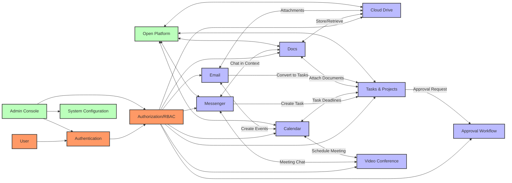
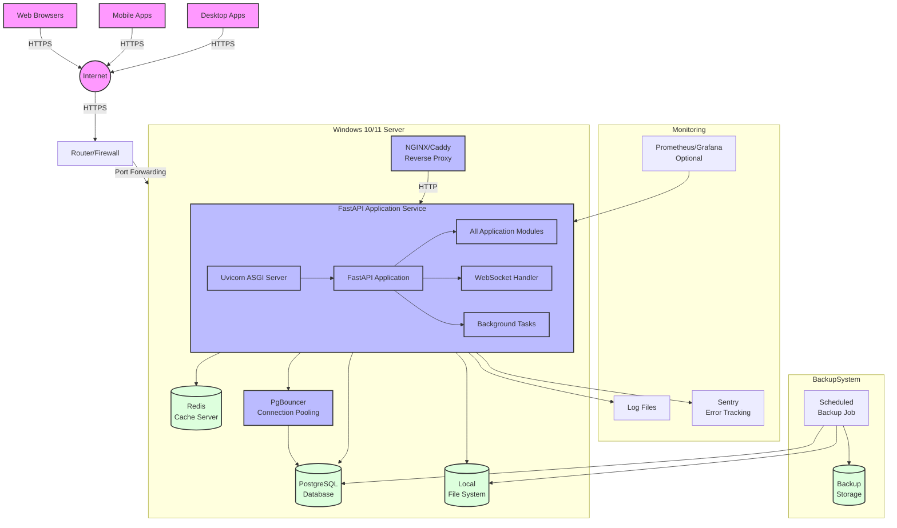

# Summary Diagram (Conceptual)

```
+---------------------+     +---------------------+     +---------------------+
|     Web Client      |     |   Mobile Clients    |     |  Desktop Clients    |
| (React + TypeScript)|     | (Flutter/React Native) |   | (Tauri + React)    |
+---------------------+     +---------------------+     +---------------------+
            |                           |                          |
            +---------------------------+--------------------------+
                                        |
                                +------------------+
                                |    Reverse Proxy | (NGINX/Caddy + SSL)
                                +------------------+
                                        |
+-----------------------------------------------------------------------------+
| Windows Server (Windows 10/11 Pro)                                          |
|                                                                             |
|    +-----------------------------------------------------------------+     |
|    |                      FastAPI Application                         |     |
|    |                                                                   |     |
|    |  +----------------+  +----------------+  +----------------+      |     |
|    |  | API Gateway    |  | Authentication |  | Authorization  |      |     |
|    |  +----------------+  +----------------+  +----------------+      |     |
|    |                                                                   |     |
|    |  +----------------+  +----------------+  +----------------+      |     |
|    |  | Messenger      |  | Calendar       |  | Docs           |      |     |
|    |  | Module         |  | Module         |  | Module         |      |     |
|    |  +----------------+  +----------------+  +----------------+      |     |
|    |                                                                   |     |
|    |  +----------------+  +----------------+  +----------------+      |     |
|    |  | Cloud Drive    |  | Email          |  | Tasks/Projects |      |     |
|    |  | Module         |  | Module         |  | Module         |      |     |
|    |  +----------------+  +----------------+  +----------------+      |     |
|    |                                                                   |     |
|    |  +----------------+  +----------------+  +----------------+      |     |
|    |  | Approval       |  | Video Conf.    |  | Admin Console  |      |     |
|    |  | Module         |  | Module         |  | Module         |      |     |
|    |  +----------------+  +----------------+  +----------------+      |     |
|    |                                                                   |     |
|    |  +----------------+  +----------------+                          |     |
|    |  | Open Platform  |  | Shared Services|                          |     |
|    |  | Module         |  |                |                          |     |
|    |  +----------------+  +----------------+                          |     |
|    |                                                                   |     |
|    |  +-----------------------+  +--------------------------------+   |     |
|    |  |   WebSocket Server    |  |     Background Task Worker     |   |     |
|    |  | (Real-time Features)  |  |     (Celery/APScheduler)       |   |     |
|    |  +-----------------------+  +--------------------------------+   |     |
|    +-----------------------------------------------------------------+     |
|                                                                             |
|    +-----------------+  +---------------+  +------------------+             |
|    |    PostgreSQL   |  | Redis Cache   |  |  Local Storage   |             |
|    | (Primary Data)  |  | (Cache/PubSub)|  |  (File System)   |             |
|    +-----------------+  +---------------+  +------------------+             |
|                                                                             |
|    +-----------------+  +---------------+                                   |
|    | Backup System   |  |  Monitoring   |                                   |
|    | (Scheduled Jobs)|  | (Logging/Metrics) |                               |
|    +-----------------+  +---------------+                                   |
|                                                                             |
+-----------------------------------------------------------------------------+
```

## Detailed System Architecture Flow

```mermaid
flowchart TD
    %% Clients
    WebClient[Web Client\nReact + TypeScript] -->|HTTPS| ReverseProxy[Reverse Proxy\nNGINX/Caddy]
    MobileClient[Mobile Clients\nFlutter/React Native] -->|HTTPS| ReverseProxy
    DesktopClient[Desktop Clients\nTauri + React] -->|HTTPS| ReverseProxy
    
    %% Main Flow
    ReverseProxy -->|HTTP| FastAPI[FastAPI Application]
    
    %% API Gateway & Auth
    FastAPI --> APIGateway[API Gateway & Routing]
    APIGateway --> Auth[Authentication\nJWT, OAuth2, MFA]
    APIGateway --> RBAC[Authorization\nRBAC, Casbin]
    
    %% Modules
    APIGateway --> Messenger[Messenger Module]
    APIGateway --> Calendar[Calendar Module]
    APIGateway --> Docs[Docs Module]
    APIGateway --> Drive[Cloud Drive Module]
    APIGateway --> Email[Email Module]
    APIGateway --> Tasks[Tasks & Projects Module]
    APIGateway --> Approval[Approval Workflow Module]
    APIGateway --> VideoConf[Video Conference Module]
    APIGateway --> AdminConsole[Admin Console Module]
    APIGateway --> OpenPlatform[Open Platform Module]
    
    %% Data Storage
    PostgreSQL[(PostgreSQL Database)] <--> FastAPI
    Redis[(Redis\nCache & PubSub)] <--> FastAPI
    FileStorage[(Local File Storage)] <--> Drive
    FileStorage <--> Docs
    FileStorage <--> VideoConf
    
    %% Real-time Communication
    WebSockets[WebSocket Server] <--> Messenger
    WebSockets <--> Docs
    WebSockets <--> Calendar
    WebSockets <--> VideoConf
    WebSockets -->|Real-time Updates| WebClient
    WebSockets -->|Real-time Updates| MobileClient
    WebSockets -->|Real-time Updates| DesktopClient
    
    %% Video Conferencing Details
    VideoConf --> WebRTCSignaling[WebRTC Signaling Server]
    WebRTCSignaling <-->|Signaling| WebClient
    WebRTCSignaling <-->|Signaling| MobileClient
    WebRTCSignaling <-->|Signaling| DesktopClient
    WebClient <-->|P2P/SFU Media| WebClient
    WebClient <-->|P2P/SFU Media| MobileClient
    MobileClient <-->|P2P/SFU Media| MobileClient
    
    %% Background Tasks
    BackgroundTasks[Background Tasks\nCelery/APScheduler] <--> FastAPI
    BackgroundTasks -->|Email Sending| EmailServer[Email Server]
    BackgroundTasks -->|File Processing| FileStorage
    BackgroundTasks -->|Scheduled Jobs| PostgreSQL
    
    %% Monitoring & Backup
    Monitor[Monitoring\nLogging & Metrics] <--> FastAPI
    BackupSystem[Backup System] --> PostgreSQL
    BackupSystem --> FileStorage
    
    %% Admin Functions
    AdminConsole -->|User Management| PostgreSQL
    AdminConsole -->|System Config| ConfigStore[(Configuration)]
    AdminConsole -->|Monitoring| Monitor
    
    %% Module Specific Features
    Docs -->|Real-time Collaboration| YjsCRDT[Yjs CRDT]
    Drive -->|Thumbnail Generation| ImageProcessor[Image Processor]
    Email -->|SMTP/IMAP| EmailServer
    Approval -->|Workflow Engine| WorkflowDB[(Workflow Definitions)]
    OpenPlatform -->|REST API & Webhooks| ExternalApps[External Applications]
    
    %% Legend
    classDef module fill:#f9f,stroke:#333,stroke-width:2px;
    classDef storage fill:#bbf,stroke:#333,stroke-width:2px;
    classDef client fill:#dfd,stroke:#333,stroke-width:2px;
    
    class Messenger,Calendar,Docs,Drive,Email,Tasks,Approval,VideoConf,AdminConsole,OpenPlatform module;
    class PostgreSQL,Redis,FileStorage,ConfigStore,WorkflowDB storage;
    class WebClient,MobileClient,DesktopClient client;
```



## Module Relationship Diagram



## Deployment Architecture on Windows Server


